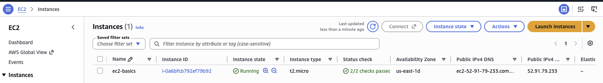
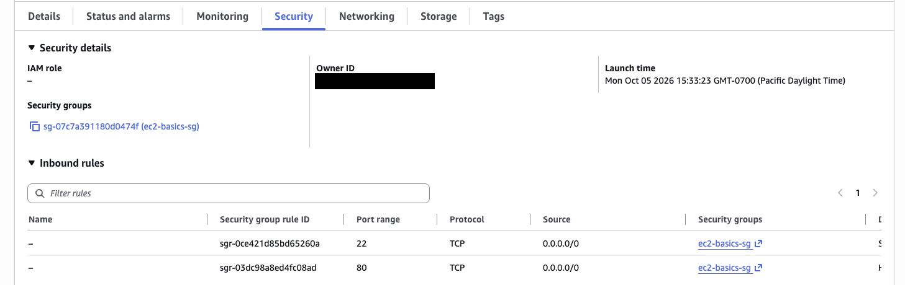
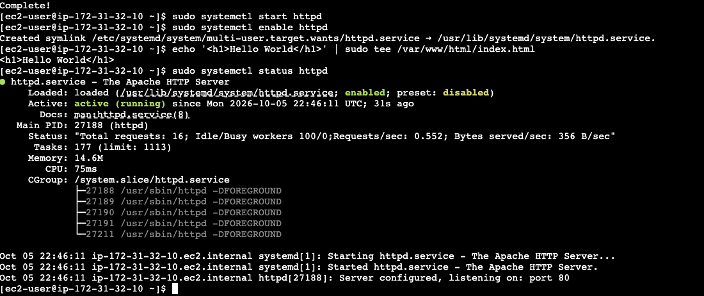
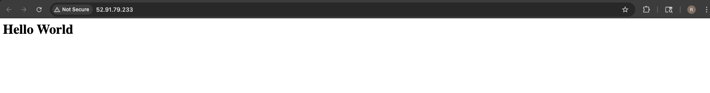

# EC2 Hello World Web Server

### Objective
Launch a virtual server in the cloud, install a web server on it, and make a web page reachable from the internet.

### What I did
I launched a t2.micro Amazon Linux 2023 instance, attached a security group that allows HTTP (port 80) and SSH (port 22), and connected through EC2 Instance Connect without a key pair. I installed and started Apache, published a Hello World page, and loaded it in my browser using the instance's public IP.

### Services I learned
- **Amazon EC2**: launching and managing a Linux virtual server
- **Security Groups**: acting as the instance firewall
- **EC2 Instance Connect**: browser-based SSH with no keys to manage
- **Apache (httpd) on Linux**: installing, starting and enabling a service with yum and systemctl

## Architecture

```
Browser --HTTP:80--> Security Group (80, 22 open) --> EC2 t2.micro (Amazon Linux 2023) --> Apache --> /var/www/html/index.html
```

## Steps
1. Launched a **t2.micro** instance (Amazon Linux 2023 AMI) named `ec2-basics`, with no key pair, attached to a security group allowing ports 80 and 22.
2. Connected through **EC2 Instance Connect** in the browser.
3. Installed and started Apache:

```bash
sudo yum update -y
sudo yum install -y httpd
sudo systemctl start httpd
sudo systemctl enable httpd
echo '<h1>Hello World</h1>' | sudo tee /var/www/html/index.html
sudo systemctl status httpd     # Active: active (running)
```

4. Opened `http://<public-ip>` in a browser and saw the page.

## Screenshots
**t2.micro instance `ec2-basics` launched and running in us-east-1**



**Security group `ec2-basics-sg`: inbound HTTP (80) and SSH (22) open**



**Apache installed and `httpd` active (running), listening on port 80**



**Hello World page served from the instance's public IP over HTTP**



## Troubleshooting notes
- The page only loads over `http://`. Port 443 isn't open, so the Console's "open address" link (https) fails.
- If the browser can't reach the site, check that the instance is Running and `httpd` is active.

## What I learned
- How security groups act as the instance firewall.
- EC2 Instance Connect gives shell access without managing SSH keys.
- With EC2 I own the OS and the web server, which is the trade-off against serverless options like Lambda.
