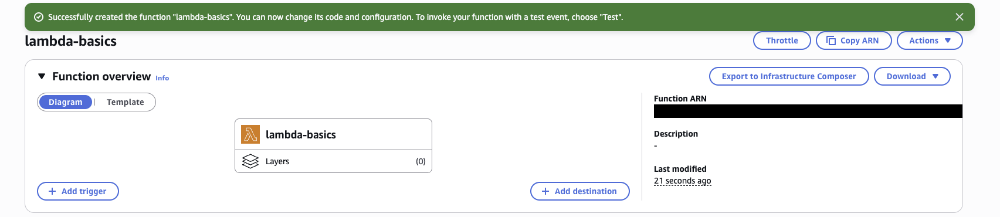
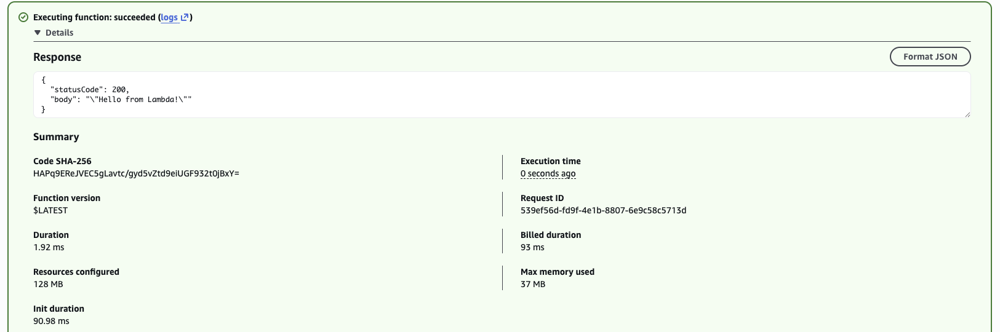
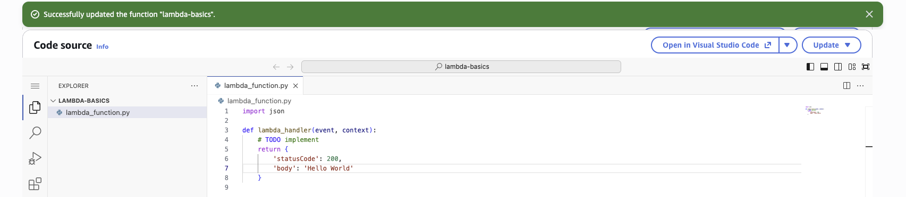
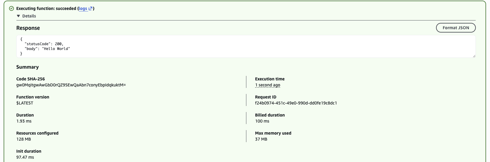
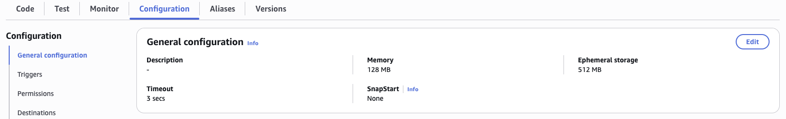

# Lambda Hello World

### Objective
Build and run a first serverless function and understand how Lambda differs from running a server on EC2.

### What I did
I created a Python 3.12 Lambda function with an existing execution role, invoked it with a test event, then changed and deployed the code so it returns Hello World. I also reviewed its memory setting and the account's concurrency pool to see how Lambda scales and how it's billed.

### Services I learned
- **AWS Lambda**: writing, deploying, testing and configuring serverless functions
- **IAM execution roles**: giving a function permissions without storing credentials
- **Amazon CloudWatch**: where Lambda execution logs are sent

## Steps
1. Created a function named `lambda-basics` (Python 3.12) using an existing execution role.
2. Created a test event (`{}`) and invoked it from the Console (returned `statusCode: 200`).
3. Changed the handler to return Hello World and **deployed** it:

```python
def lambda_handler(event, context):
    return {
        'statusCode': 200,
        'body': 'Hello World'
    }
```

4. Re-ran the test and confirmed the body was `Hello World`.
5. Reviewed **General configuration** (memory) and **Concurrency**.

## Screenshots
**Function `lambda-basics` created (Python 3.12)**



**Before: first test invoke returns the default `Hello from Lambda!` (statusCode 200, 128 MB configured, 37 MB used)**



**Handler edited to return `Hello World` and deployed**



**After: re-running the test returns `"body": "Hello World"`**



**General configuration: 128 MB memory, 3 second timeout, 512 MB ephemeral storage**




## What I learned
- Code changes do nothing until you click **Deploy**.
- Lambda lets you choose memory only; CPU is allocated in proportion to it. More memory is faster but costs more per millisecond.
- Unreserved concurrency is a pool shared by every function in the account and region. Reserved concurrency guarantees capacity for a critical function and also caps cost.
- No servers or AMIs to manage, which is why serverless suits spiky or infrequent traffic.
