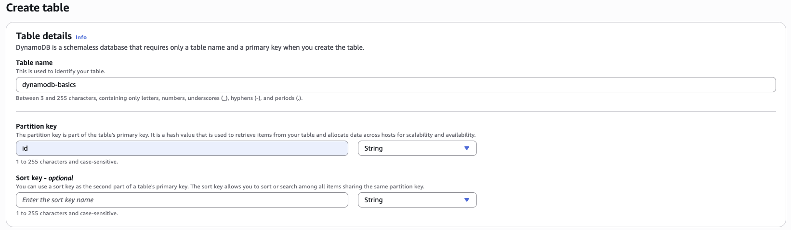
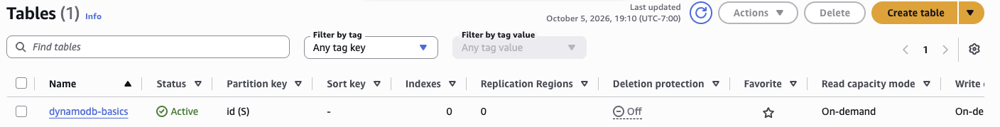
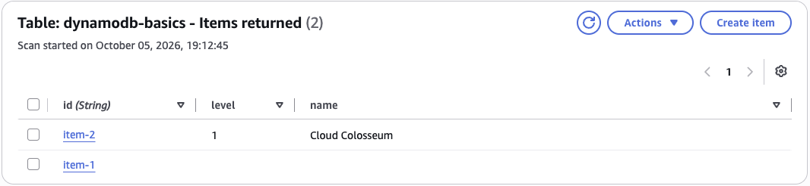
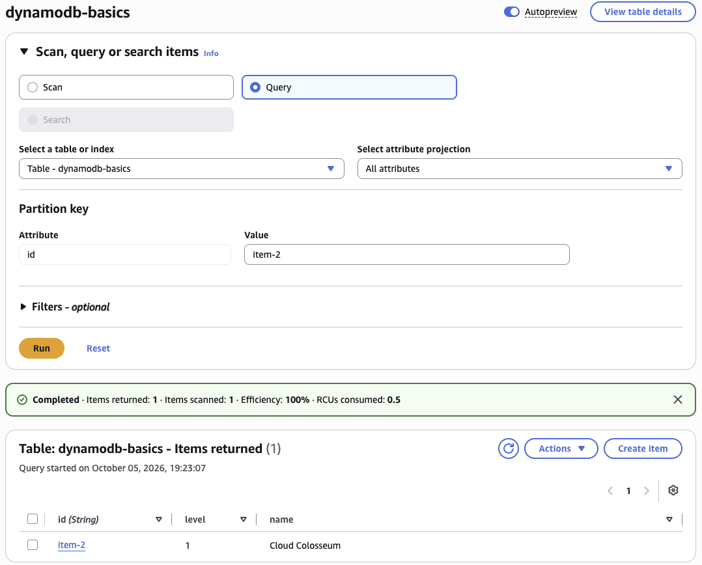

# DynamoDB Basics

### Objective
Create a NoSQL table and learn how DynamoDB stores and finds data.

### What I did
I created a DynamoDB table with a string partition key named `id`, added an item with string and number attributes, and looked it up by its key in the Console's table explorer.

### Services I learned
- **Amazon DynamoDB**: table creation, key schema design, and creating and browsing items

## Steps
1. Created table `dynamodb-basics` with partition key `id` (String), default settings.
2. Added an item with **Explore table items → Create item**:

| Attribute | Type   | Value           |
|-----------|--------|-----------------|
| id        | String | item-2          |
| name      | String | Cloud Colosseum |
| level     | Number | 1               |

3. Filtered by partition key `item-2` and confirmed all three attributes.

## Screenshots
**Designing the table: name `dynamodb-basics` with a String partition key `id`**

**Table created and Active, on-demand capacity, partition key `id (S)`**

**Item saved: `item-2` with a String `name` and a Number `level` (item-1 holds only its key, which shows DynamoDB's flexible schema)**

**Query by partition key `id = item-2`: 1 item returned, 1 scanned, 100% efficiency (vs. a full table scan)**

## What I learned
- DynamoDB only needs the key schema up front; every other attribute is flexible per item.
- The partition key is how DynamoDB finds an item quickly, so choosing it well matters.
