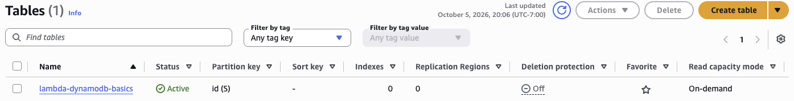
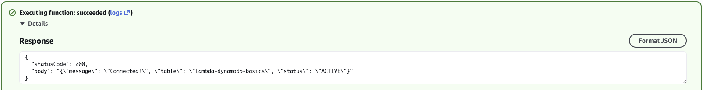
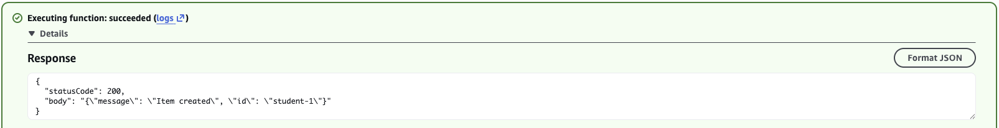
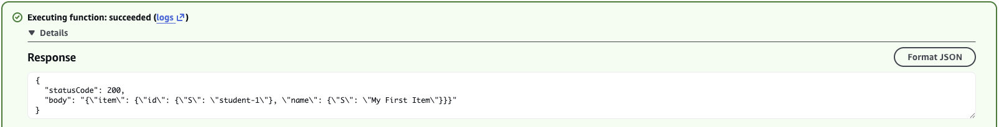
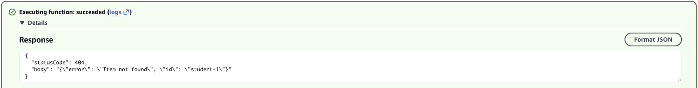

# Lambda + DynamoDB CRUD

### Objective
Connect serverless code to a managed database and perform the create, read and delete operations that sit behind most apps.

### What I did
I deployed a Python Lambda function that uses boto3 to check its connection to a DynamoDB table and to put, get and delete items, choosing the operation from an `action` field in the event. I tested each operation with JSON test events, including a 404 response for a missing item.

### Services I learned
- **AWS Lambda**: a serverless backend routed by request type
- **Amazon DynamoDB**: put_item, get_item and delete_item, plus its typed JSON format
- **IAM execution roles**: database access without passwords or connection strings
- **boto3 (AWS SDK for Python)**: calling AWS services from code

## Architecture

```
Test event {"action": ...} --> Lambda (Python, boto3) --IAM role--> DynamoDB table
```

## Code
Full source: [`lambda_function.py`](lambda_function.py). The table name comes from the `TABLE_NAME` environment variable.

| action               | What it does                                   | Response        |
|----------------------|------------------------------------------------|-----------------|
| `check_connectivity` | `describe_table`, returns table status          | 200, `ACTIVE`   |
| `put_item`           | Inserts or overwrites an item                   | 200             |
| `get_item`           | Looks up an item by `id`                        | 200 or 404      |
| `delete_item`        | Deletes an item by `id`                         | 200 (or 400 if no id) |

## Testing
```json
{ "action": "check_connectivity" }
{ "action": "put_item", "id": "student-1", "name": "My First Item" }
{ "action": "get_item", "id": "student-1" }
{ "action": "delete_item", "id": "student-1" }
{ "action": "get_item", "id": "student-1" }      // now returns 404
```

## Screenshots
**The `lambda-dynamodb-basics` table the function reads and writes (Active, partition key `id`)**



**`check_connectivity`: Lambda reaches the `lambda-dynamodb-basics` table through its IAM role and reports it ACTIVE**



**`put_item`: Lambda writes `student-1` to the table with boto3**



**`get_item`: reading `student-1` back, in DynamoDB's typed JSON format (`{"S": ...}`)**



**`delete_item`: removing `student-1`**


**`get_item` after the delete: the code returns its own 404 "Item not found", since DynamoDB returns no error for a missing key**




## What I learned
- No connection string or password: boto3 authenticates with the Lambda's **execution role**.
- The low-level client wraps every value in a type descriptor (`{"S": "..."}`, `{"N": "5"}`).
- `put_item` silently overwrites, `get_item` returns no `Item` instead of an error (so the code returns 404 itself), and `delete_item` on a missing key is a no-op.
- Reading config from environment variables lets the same code target dev, test and prod tables.
