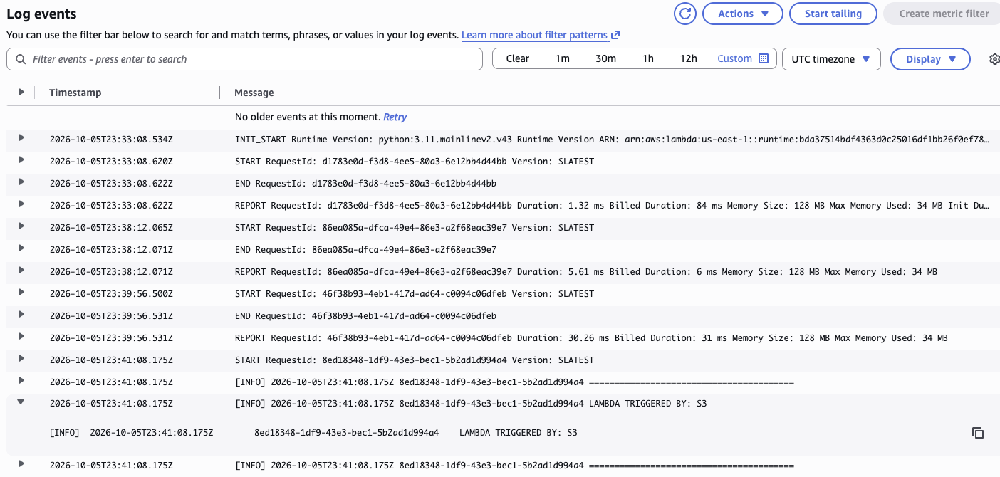
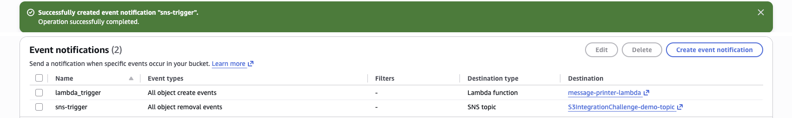
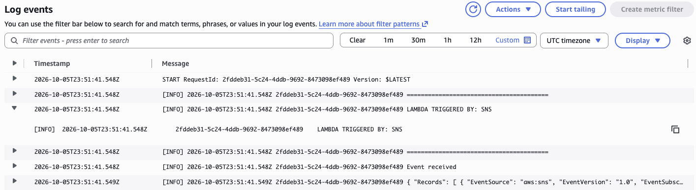
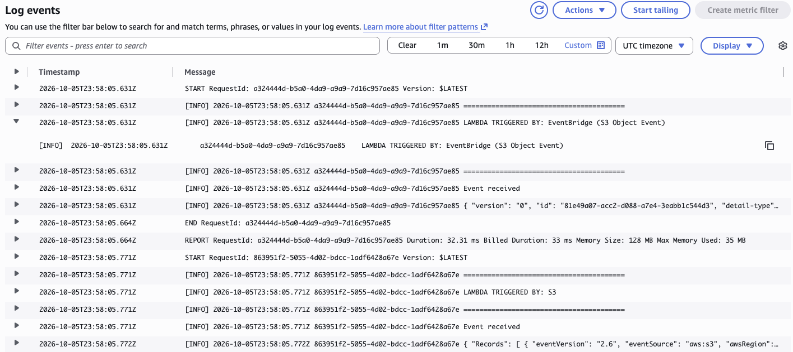
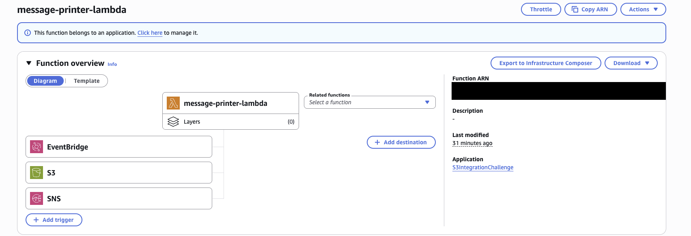

# S3 Event-Driven Architecture

### Objective
Build an event-driven system where uploading or deleting a file in S3 automatically triggers other AWS services.

### What I did
I set up S3 event notifications so new uploads trigger a Lambda function directly and deletions send a message through an SNS topic to the same function. I also turned on EventBridge delivery for the bucket. Then I confirmed each path in CloudWatch Logs, where the function logged which service triggered it.

### Services I learned
- **Amazon S3**: event notifications
- **AWS Lambda**: processing events
- **Amazon SNS**: publish/subscribe messaging and fan-out
- **Amazon EventBridge**: event routing with rules
- **CloudWatch Logs**: verifying and troubleshooting the event flow

## Architecture

```
                 ┌── object created ──────────────► Lambda (message-printer)
S3 bucket ───────┼── object removed ──► SNS topic ─► Lambda
                 └── all events ──────► EventBridge (default bus, rule) ─► Lambda
```

## Steps
1. **S3 → Lambda.** Added an event notification `lambda-trigger` for *All object create events*. Uploading a file logged `LAMBDA TRIGGERED BY: S3`.
2. **S3 → SNS → Lambda.** Added `sns-trigger` for *All object removal events* targeting an SNS topic subscribed by the Lambda. Deleting the file logged `LAMBDA TRIGGERED BY: SNS`.
3. **S3 → EventBridge → Lambda.** Turned on *Send notifications to Amazon EventBridge*. A new upload produced two log entries, one direct and one from EventBridge (identifiable by its `detail-type` field).

## Screenshots
**Level 1: uploading a file to S3 triggers the Lambda, which logs `LAMBDA TRIGGERED BY: S3`**



**Level 2: two event notifications on one bucket, uploads go to Lambda and deletions go to SNS**



**Deleting the object publishes to SNS, which invokes the Lambda (`LAMBDA TRIGGERED BY: SNS`, `"EventSource": "aws:sns"`)**



**Level 3: with EventBridge on, one upload invokes the Lambda twice, once through EventBridge (`detail-type`) and once directly from S3 (`eventSource: aws:s3`)**



**The finished architecture: `message-printer-lambda` with three triggers, EventBridge, S3 and SNS**




## What I learned
- S3 can notify Lambda, SNS, SQS and EventBridge, not just Lambda.
- Two notifications can't share the same event type with overlapping prefix and suffix filters.
- Event payloads carry object metadata, not the object content.
- EventBridge receives *all* bucket events with no prefix or suffix filtering in S3; filtering happens in EventBridge rules. It can route to many targets, such as Step Functions for file-processing pipelines.
- SNS in the middle enables fan-out to many subscribers.
