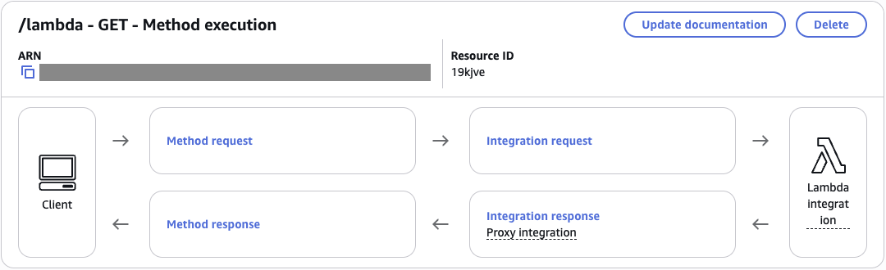
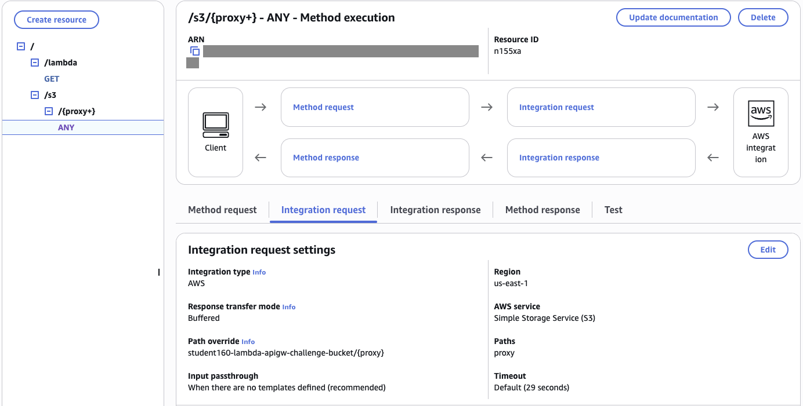
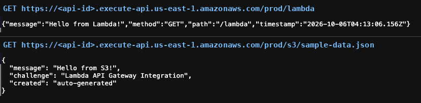

# API Gateway: Lambda Proxy and Direct S3 Integration

### Objective
Build a REST API that serves data from two kinds of backends: a Lambda function, and an S3 bucket called directly without any code.

### What I did
I created a `/lambda` resource with a Lambda proxy integration and an `/s3/{proxy+}` resource that calls S3 directly through an IAM execution role, using a path override. I added method response headers, deployed the API to a `prod` stage, and tested both endpoints in my browser.

### Services I learned
- **Amazon API Gateway (REST)**: resources, methods, proxy and AWS service integrations, and stages
- **AWS Lambda**: proxy integration request and response format
- **Amazon S3**: serving objects through an API
- **AWS IAM**: an execution role that lets API Gateway read S3

## Architecture

```
                Client
          ┌───────┴────────┐
   GET /lambda      ANY /s3/{proxy+}
          │                │
     API Gateway (stage: prod)
          │                │
  Lambda proxy      AWS service integration (S3 GetObject, path override)
          │                │
      Lambda          S3 bucket / sample-data.json
```

Resource tree:
```
/
├── /lambda
│   └── GET        → Lambda function (proxy integration)
└── /s3
    └── /{proxy+}
        └── ANY    → S3 bucket (filename taken from URL)
```

## Steps
1. Created `/lambda` with a **GET** method using **Lambda proxy integration**.
2. Created `/s3` and a greedy child `{proxy+}` resource.
3. Configured `ANY /s3/{proxy+}` as an **AWS Service** integration: S3, HTTP GET, path override `<bucket>/{proxy}`, and an IAM execution role that lets API Gateway read the bucket.
4. Added a 200 method response with `Content-Type`, `Content-Length` and `Timestamp` headers.
5. Deployed to a `prod` stage and tested in the browser:
   - `https://<api-id>.execute-api.<region>.amazonaws.com/prod/lambda` returned JSON from Lambda
   - `https://<api-id>.execute-api.<region>.amazonaws.com/prod/s3/sample-data.json` returned the file from S3

## Screenshots
**`GET /lambda` method execution: Client → Method request → Integration request → Lambda, using Lambda proxy integration (ARN redacted)**



**Resource tree and `ANY /s3/{proxy+}`: an AWS service integration that calls S3 directly (no Lambda), with path override `<bucket>/{proxy}` (ARN redacted)**



**Deployed to `prod` and tested in the browser: `/prod/lambda` returns "Hello from Lambda!" and `/prod/s3/sample-data.json` returns the file straight from S3 ("Hello from S3!")**



## What I learned
- **Proxy integration** passes the whole request (path, headers, body) to Lambda, which must return `statusCode`, `headers` and `body`. It's the default for modern APIs.
- API Gateway can call AWS services like S3 directly, saving a Lambda hop for simple reads. S3 expects a plain REST call, so this one isn't a proxy integration.
- `{proxy+}` is a greedy path variable that captures everything after the base path.
- Nothing is live until the API is **deployed** to a stage.
