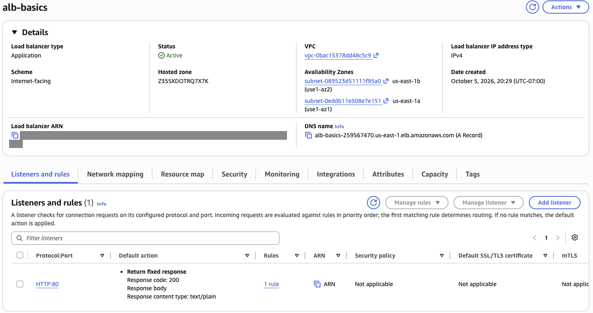
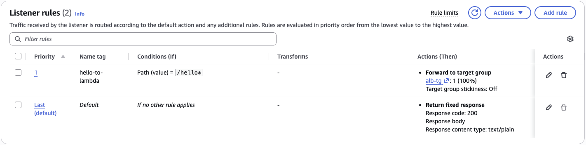
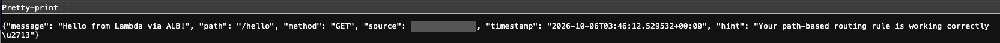
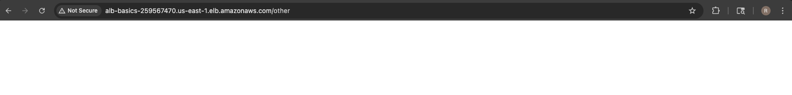

# Application Load Balancer: Path-Based Routing to Lambda

### Objective
Put an Application Load Balancer in front of a backend and use a listener rule to route requests by URL path, the pattern companies use to run many services behind one domain.

### What I did
I created an internet-facing ALB named `alb-basics` across two Availability Zones in a dedicated VPC, with its own security group and an HTTP:80 listener whose default action returns a fixed 200 response. I then added a priority-1 listener rule that forwards any path matching `/hello*` to a Lambda target group, and tested it in the browser: `/hello` returned JSON from Lambda, while other paths fell through to the default response.

### Services I learned
- **Elastic Load Balancing (ALB)**: a Layer 7 load balancer, listeners, rules, priorities and default actions
- **Target groups**: registering a Lambda function as an ALB target
- **AWS Lambda**: serving HTTP requests that arrive through a load balancer
- **Amazon VPC**: public subnets in two Availability Zones and security groups for an internet-facing ALB

## Architecture

```
Internet
   │
   ▼ HTTP:80
┌──────────────────────────────┐
│  ALB: alb-basics             │
│                              │
│  Rule priority 1:            │
│  Path /hello*  ──────────────┼──► Target group alb-tg ──► Lambda
│                              │
│  Default (catch-all):        │
│  Fixed 200 response          │
└──────────────────────────────┘
```

## Steps
1. **Create the ALB:** name `alb-basics`, internet-facing, IPv4, VPC `alb-basics-vpc`, subnets `alb-basics-subnet-1` and `alb-basics-subnet-2` in two AZs, security group `alb-basics-sg`, listener HTTP:80 with a default fixed 200 response.
2. **Add a routing rule:** on the HTTP:80 listener, a rule with condition Path = `/hello*`, action Forward to `alb-tg`, priority 1.
3. **Test:** `http://<ALB-DNS-name>/hello` returns the Lambda's JSON ("Hello from Lambda via ALB!"); `http://<ALB-DNS-name>/other` returns the default fixed response.

## Screenshots
**Level 1: `alb-basics` Active, internet-facing across two Availability Zones (us-east-1a and 1b), with an HTTP:80 listener returning a fixed 200 by default (ARN redacted)**



**Level 2: listener rules in priority order: `/hello*` forwards to the Lambda target group `alb-tg`, and everything else falls through to the default fixed 200 response**



**Level 3: `http://<ALB-DNS>/hello` answered by Lambda through the ALB: "Hello from Lambda via ALB!" (my IP redacted)**



**Level 3: `/other` does not match the rule, so the ALB's default action answers with its fixed 200 response (an empty body) and Lambda is never called**



## What I learned
- An ALB works at Layer 7, so it can route on the URL path, host name or headers, not just spread traffic evenly.
- Listener rules are checked in priority order, and the default action catches anything no rule matches.
- An internet-facing ALB needs public subnets in at least two Availability Zones and a security group, because it lives inside a VPC (unlike API Gateway).
- Lambda target groups have health checks off by default, since every health check would be a paid invocation.
