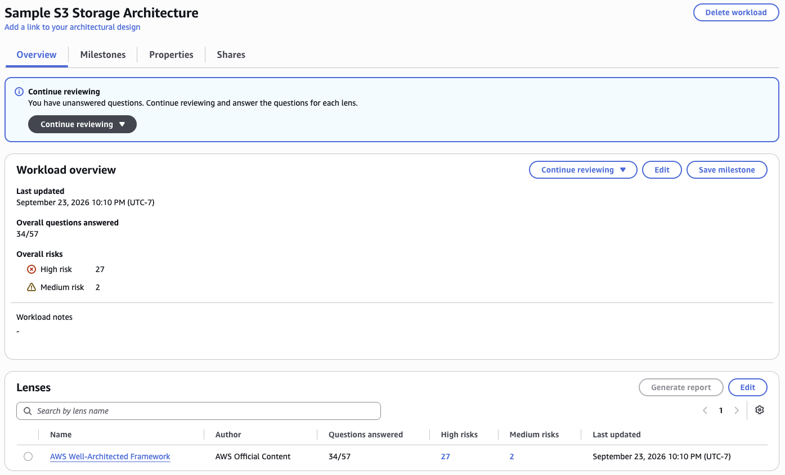
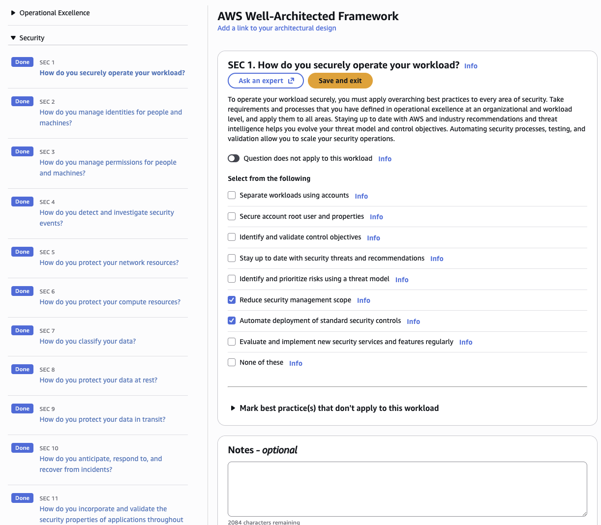
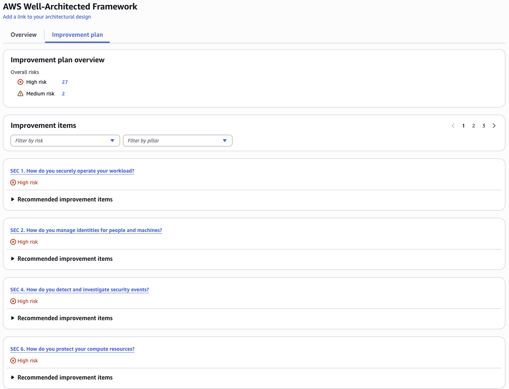
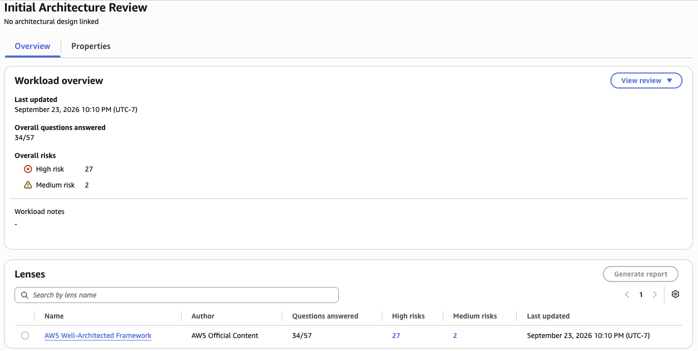

# AWS Well-Architected Review: Sample S3 Storage Architecture

### Objective
Evaluate a real workload against the AWS Well-Architected Framework, find its highest risks, and turn them into a prioritized improvement plan.

### What I did
I defined a production workload, "Sample S3 Storage Architecture", in the AWS Well-Architected Tool using an encrypted S3 bucket as the system under review. I answered the review questions for the Security, Reliability and Cost Optimization pillars then used the improvement plan to rank the high and medium risks and saved the result as a milestone named "Initial Architecture Review".

### Services I learned
- **AWS Well-Architected Tool**: defining workloads, running pillar reviews, improvement plans and milestones
- **AWS Well-Architected Framework**: the six pillars and the trade-offs between them
- **Amazon S3**: assessing access control, encryption, durability and storage cost against best practices

## The six pillars
| Pillar | Focus |
|---|---|
| Operational Excellence | Running and monitoring systems, and improving processes |
| Security | Protecting data, systems and assets |
| Reliability | Performing correctly and consistently, and recovering from failure |
| Performance Efficiency | Using resources efficiently as demand changes |
| Cost Optimization | Avoiding unnecessary cost and understanding spend |
| Sustainability | Minimizing the environmental impact of workloads |

## Steps
1. **Define the workload:** name "Sample S3 Storage Architecture", environment Production, current region.
2. **Review pillars:** answered every question for at least three pillars, marking "Does not apply" where relevant.
3. **Improvement plan:** reviewed the high and medium risk items and saved a milestone, "Initial Architecture Review".

## Top risks found
The review flagged 27 high risks and 2 medium risks. The top items in the improvement plan were all in the Security pillar:

1. **SEC 1, Securely operate the workload:** there is no account-level security baseline (separate accounts, guardrails, security contacts). Fix: use AWS Organizations with service control policies, and keep the root user locked down with MFA.
2. **SEC 2, Manage identities for people and machines:** access relies on broad credentials. Fix: use IAM roles and temporary credentials, enforce MFA, and grant least-privilege access to the S3 bucket.
3. **SEC 4, Detect and investigate security events:** nothing alerts on suspicious activity. Fix: turn on CloudTrail and S3 server access logging, and use GuardDuty and CloudWatch alarms to surface findings.

SEC 6 (protect compute resources) was also high risk, but it matters less for an S3-only storage workload.

## Screenshots
**Workload overview: 34 of 57 questions answered, with 27 high risks and 2 medium risks found**

**Security pillar question SEC 1, showing the practices in place; every Security question is marked Done in the left panel**

**Improvement plan, with the high-risk Security items ranked first**

**Saved milestone "Initial Architecture Review", capturing the review at this point in time**

## What I learned
- A Well-Architected review is broader than a security audit: it also weighs reliability, cost, performance, operations and sustainability.
- Pillars can conflict (for example cost vs. reliability), so the framework is about making informed trade-offs, not a perfect score.
- High-risk items give a clear order for fixing things, and milestones let you track progress between reviews.
- Reviews should be repeated over time as the workload changes.
