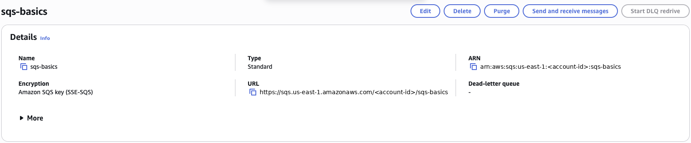
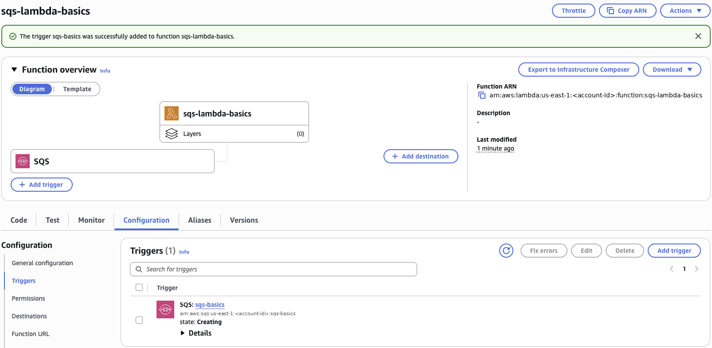
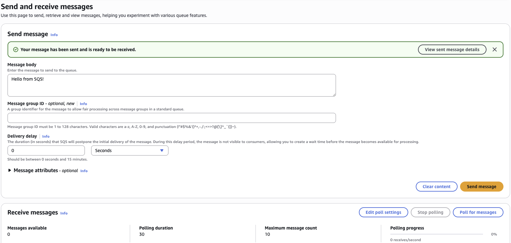
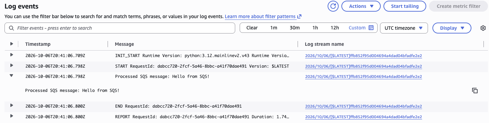

# SQS + Lambda Basics: Connect a Queue to a Function

### Objective
Decouple a producer from a consumer by putting an Amazon SQS queue in front of a Lambda function, so messages are buffered and processed automatically.

### What I did
I created a standard SQS queue (`sqs-basics`) and a Python 3.12 Lambda function (`sqs-lambda-basics`) using a pre-created execution role. I connected them with an SQS trigger, sent a test message from the SQS console and confirmed in CloudWatch Logs that the function picked it up and processed it.

### Services I learned
- **Amazon SQS**: standard queues, sending messages and the visibility timeout
- **AWS Lambda**: SQS triggers (event source mappings) and batch processing of `Records`
- **AWS IAM**: using an existing execution role
- **Amazon CloudWatch Logs**: verifying what a function did

## How it works
```
Producer (SQS console) ──► SQS queue (sqs-basics) ──► Lambda poller ──► sqs-lambda-basics ──► CloudWatch Logs
```
The producer drops a message on the queue and moves on. Lambda's event source mapping polls the queue for me and invokes the function with a batch of messages. If the function succeeds, SQS deletes the messages; if it throws an error, they reappear after the visibility timeout and are retried.

## Steps
1. **Create the queue.** Standard queue `sqs-basics`, default settings. Studied the visibility timeout.
2. **Create the function.** `sqs-lambda-basics`, Python 3.12, existing role `sqsbasics-execution-role`, with the code below.
3. **Add the trigger.** SQS → `sqs-basics`.
4. **Test.** Sent `Hello from SQS!` from *Send and receive messages* and found `Processed SQS message: Hello from SQS!` in CloudWatch Logs.

```python
import json

def lambda_handler(event, context):
    for record in event.get("Records", []):
        body = record.get("body")
        print(f"Processed SQS message: {body}")

    return {
        "statusCode": 200,
        "body": json.dumps({"processed": len(event.get("Records", []))})
    }
```

## Screenshots
**Standard queue `sqs-basics` created**



**Lambda function with the SQS trigger connected**



**Test message sent; "Messages available: 0" because Lambda picked it up right away**



**CloudWatch Logs proving the function processed the message**



## What I learned
- **Decoupling:** the sender never waits for, or even knows about, the consumer. The queue absorbs traffic spikes, so downstream systems aren't overwhelmed.
- **Batches:** SQS delivers messages to Lambda in a `Records` list (up to 10 by default), so the code always loops.
- **No polling code:** there's no `boto3.client("sqs")`. The trigger (event source mapping) is an AWS-managed poller that invokes the function.
- **Success vs. failure:** SQS only cares whether the function returns or raises. On an error, messages become visible again after the **visibility timeout**, which should be longer than the function's run time to avoid processing a message twice.
