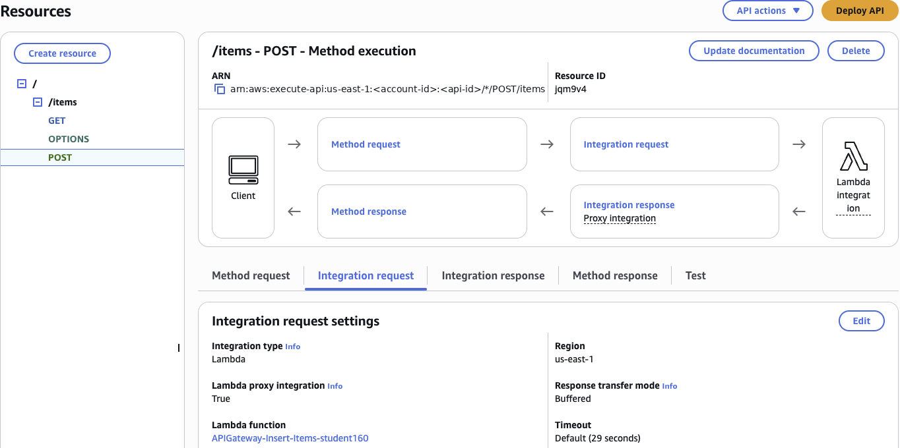
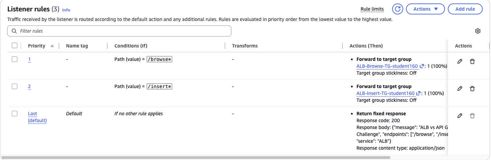
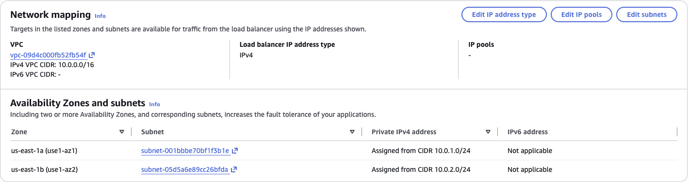
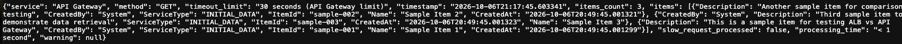
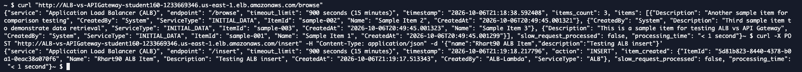
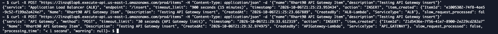

# ALB vs API Gateway: Same Backend, Two Front Doors

### Objective
Put an Application Load Balancer and an API Gateway REST API in front of the same Lambda + DynamoDB backend, finish the missing configuration on each, and compare how they behave.

### What I did
I added a `POST` method on the API Gateway `/items` resource (Lambda proxy integration to the insert function) and deployed it to `prod`. On the ALB, I added a listener rule that forwards `/insert*` to the insert Lambda target group at priority 2, next to the existing `/browse` rule. Then I tested browse and insert through both front doors with `curl` from CloudShell, and compared networking, security and routing.

### Services I learned
- **Application Load Balancer (ALB)**: listeners, path-based rules, priorities and Lambda target groups
- **Amazon API Gateway**: REST resources, methods, Lambda proxy integration and stage deployments
- **AWS Lambda** and **Amazon DynamoDB**: the shared backend both front doors call
- **Amazon VPC**: why an ALB lives in subnets and API Gateway doesn't
- **CloudShell + curl**: testing HTTP endpoints from the command line

## Architecture
```
          API Gateway (HTTPS, no VPC)                      ALB (HTTP, inside a VPC)
GET  /prod/items ─► Browse Lambda ─┐            ┌─ Browse Lambda ◄─ GET  /browse
                                   ├─► DynamoDB ◄┤
POST /prod/items ─► Insert Lambda ─┘            └─ Insert Lambda ◄─ POST /insert
```

## Steps
1. **API Gateway:** on `/items`, created a `POST` method → Lambda proxy integration → `APIGateway-Insert-Items` function, then **Deploy API** to `prod`.
2. **ALB:** on the `HTTP:80` listener, added rule *Path is `/insert*`* → forward to the insert target group, priority 2 (priority 1 is `/browse`).
3. **Networking:** compared the ALB's *Network mapping* tab (VPC + subnets) with API Gateway, which has no VPC settings.
4. **Testing:** from CloudShell:
```bash
curl "http://<alb-dns>/browse"
curl -X POST "http://<alb-dns>/insert" -H "Content-Type: application/json" \
  -d '{"name":"Rhart90 ALB Item","description":"Testing ALB insert"}'

curl "https://<api-id>.execute-api.us-east-1.amazonaws.com/prod/items"
curl -X POST "https://<api-id>.execute-api.us-east-1.amazonaws.com/prod/items" \
  -H "Content-Type: application/json" \
  -d '{"name":"Rhart90 API Gateway Item","description":"Testing API Gateway insert"}'
```

## ALB vs API Gateway

| | Application Load Balancer | API Gateway (REST) |
|---|---|---|
| **Where it lives** | Inside your VPC, attached to subnets in 2+ AZs | Fully managed, outside your VPC (private integrations/APIs are optional) |
| **Default protocol** | HTTP on its default DNS name; HTTPS needs a custom domain + ACM certificate | HTTPS out of the box with an AWS certificate |
| **Routing** | Listener rules on path, host, headers, query strings, source IP, with priorities | Resources + HTTP methods (`GET /items`, `POST /items`), stages |
| **Targets** | EC2, containers (ECS/EKS), IP addresses, Lambda | Lambda, any HTTP endpoint, many AWS services directly |
| **API features** | Few: it's a load balancer | Throttling, usage plans/API keys, request validation, auth (IAM, Cognito, Lambda authorizers), caching |
| **Cost model** | Hourly charge + capacity units, even when idle | Pay per request, nothing when idle |
| **Best for** | Steady, high-volume traffic to servers/containers | Public or partner APIs, spiky traffic, serverless backends |

## Screenshots
**1. API Gateway `POST /items`: Lambda proxy integration to `APIGateway-Insert-Items`**


**2. ALB listener rules: `/browse*` at priority 1, `/insert*` at priority 2, fixed response as the default**


**3. ALB network mapping: the load balancer lives in a VPC across two subnets in two AZs**


**4. Browsing through API Gateway in the browser (`GET /prod/items`, 30 second timeout limit)**


**5. Browsing and inserting through the ALB with curl (`/browse` and `/insert`, 900 second timeout limit)**


**6. Inserting through API Gateway: before the fix the response came from the ALB's Lambda, after the fix it comes from the API Gateway Lambda**


## Troubleshooting
My first API Gateway insert worked but returned `"service": "Application Load Balancer (ALB)"` and `"CreatedBy": "ALB-Lambda"`. The `POST` method was integrated with `ALB-Insert-Items` instead of `APIGateway-Insert-Items` (the names look alike in the dropdown). I confirmed it from the Lambda console, where the ALB function showed an API Gateway trigger it shouldn't have had. Then I changed the integration request to the correct function and redeployed to `prod`. The next request returned `"service": "API Gateway"` and `"CreatedBy": "APIGateway-Lambda"`.

Lesson: a `200`/`201` isn't proof that things work. Read the response and check which component actually handled the request.

## What I learned
- **Same backend, different front doors:** both reach the same Lambdas and DynamoDB table; the difference is everything in front.
- **Routing styles:** the ALB matches *paths* (`/insert*`) with numbered priorities, while API Gateway models *resources and methods* (`POST /items`) and only goes live after **Deploy API** to a stage.
- **Timeouts:** API Gateway cuts off integrations at about 29 to 30 seconds, while an ALB can wait as long as Lambda runs (up to 15 minutes). That makes the ALB a better fit for long-running requests.
- **Deployments matter:** editing an API Gateway method changes only the draft. Nothing changes for callers until you deploy it to a stage.
- **Networking:** an ALB must sit in VPC subnets; API Gateway isn't attached to a VPC at all.
- **Security in transit:** API Gateway is HTTPS by default; the ALB's default DNS name is plain HTTP.
- **Neither is always better:** for steady, heavy traffic an ALB's flat hourly price can beat per-request API Gateway pricing; for spiky or low traffic and rich API features, API Gateway wins.
