# AI Question API with Amazon Bedrock: Observable and Cost-Controlled

### Objective
Build a small generative AI feature, an "AWS study helper" that answers AWS questions in plain language, and run it the way a production team would: least-privilege access, limits on cost, and monitoring for usage, latency and spend.

### What I did
In my own AWS account, I tested Amazon Nova Micro in the Bedrock Playground. Then I wrote a Python Lambda function that sends a question to the model with a system prompt and returns the answer and token counts. I gave the function an IAM policy that can call only Nova Micro and put a public HTTP API in front of it. I added three layers of cost control: input and output caps in the code, API throttling, and a CloudWatch alarm on token usage that emails me. I load-tested it and built a CloudWatch dashboard for tokens and latency.

### Services I learned
- **Amazon Bedrock**: foundation models, the Playground, the Converse API, model IDs and token-based pricing
- **AWS Lambda**: Python 3.12, execution roles, timeouts, cold starts and concurrency limits
- **AWS IAM**: an inline least-privilege policy scoped to a single model ARN
- **Amazon API Gateway (HTTP API)**: Lambda proxy integration and stage throttling
- **Amazon CloudWatch**: Bedrock metrics, dashboards, structured logs and alarms
- **Amazon SNS**: email notifications for the alarm

## Architecture
```
client (curl / app)
   │  HTTPS POST {"question": "..."}
   ▼
API Gateway HTTP API ── throttling: burst 5, rate 2 req/s
   │
   ▼
Lambda ask-aws-helper ── caps: 500 chars in, 300 tokens out
   │   IAM: bedrock:InvokeModel on Nova Micro only
   ▼
Amazon Bedrock (amazon.nova-micro-v1:0)
   │
   ▼
CloudWatch: token + latency dashboard, OutputTokenCount alarm ──► SNS email
```

## Files
- [`lambda_function.py`](lambda_function.py): the Lambda code
- [`policies/bedrock-invoke-nova-micro.json`](policies/bedrock-invoke-nova-micro.json): the least-privilege IAM policy

## Steps
1. **Playground:** tested Nova Micro with "In two sentences, what is Amazon S3?" to confirm model access.
2. **Lambda:** created `ask-aws-helper` (Python 3.12) and raised the timeout from 3 to 30 seconds.
3. **IAM:** added an inline policy that allows only `bedrock:InvokeModel` on the Nova Micro model ARN.
4. **Code:** used the Bedrock **Converse API** with a system prompt ("answer in 3 sentences or fewer for a beginner"), `maxTokens: 300` and a 500-character question limit, and logged one JSON line per call with tokens and latency.
5. **API:** added an API Gateway **HTTP API** trigger, then set stage throttling to burst 5 and rate 2.
6. **Load test:** fired parallel requests from CloudShell to check the limits.
7. **Monitoring:** built the `ai-helper-monitoring` dashboard (token Sum and latency), then created the `ai-helper-token-spike` alarm (OutputTokenCount Sum > 5,000 per hour → SNS email).

```bash
curl -s -X POST "https://<api-id>.execute-api.us-east-1.amazonaws.com/default/ask-aws-helper" \
  -H "Content-Type: application/json" \
  -d '{"question":"What is AWS Lambda? Answer for Rhart90."}'
```

## Screenshots

**1. Nova Micro in the Bedrock Playground (10 input tokens, 59 output tokens, 527 ms)**
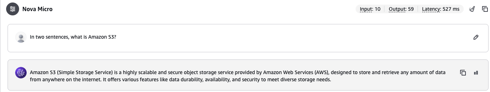

**2. The `ask-aws-helper` Lambda function**
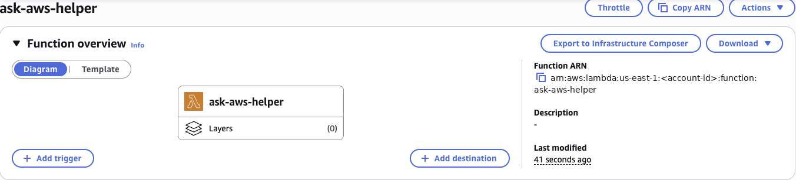

**3. Execution role with the inline `bedrock-invoke-nova-micro` policy**
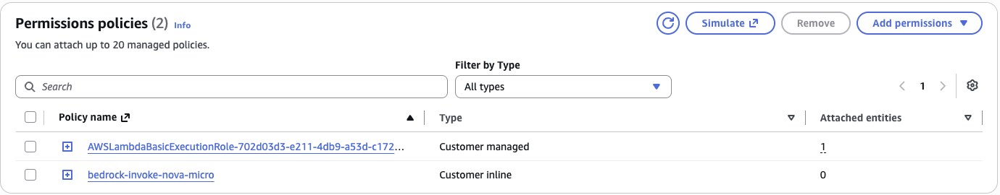

**4. Timeout raised to 30 seconds**
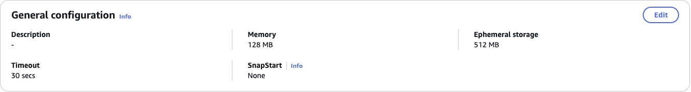

**5. Console test: the model's answer, token usage, and my structured log line (note the 460 ms cold start)**
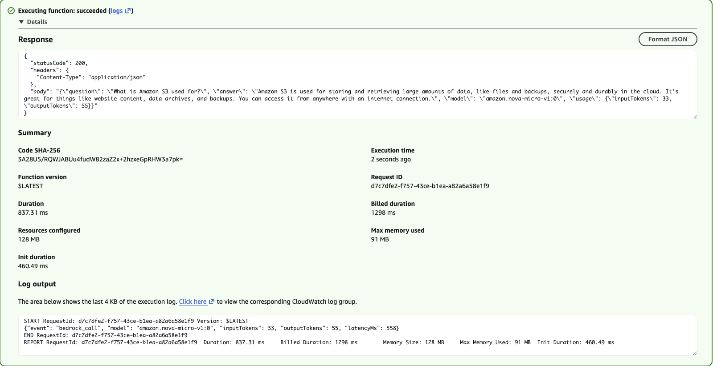

**6. API Gateway HTTP API trigger on the function**
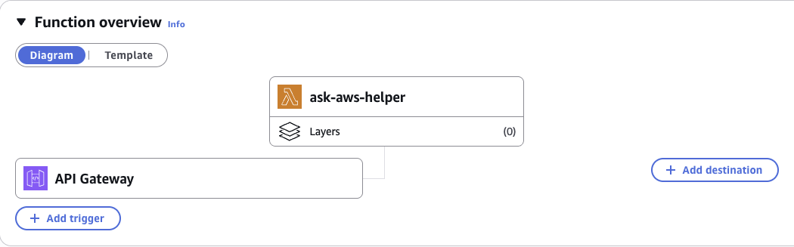

**7. End to end: a curl request to the public API returns an AI answer**
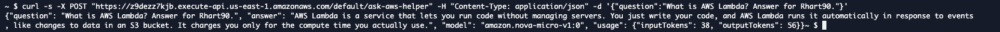

**8. Stage throttling: burst 5, rate 2 requests per second**
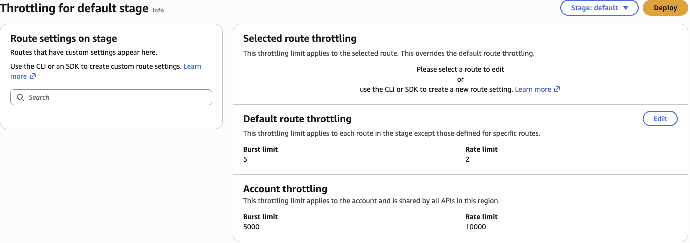

**9. Load tests: 503s from the Lambda concurrency limit, the verified stage settings, then 429s from API Gateway throttling**
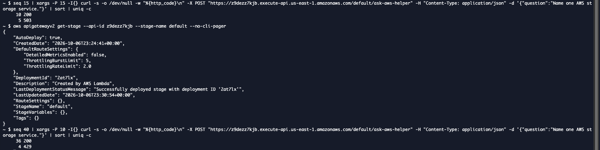

**10. CloudWatch dashboard: total tokens (Sum) and model latency, with the load-test spike visible**
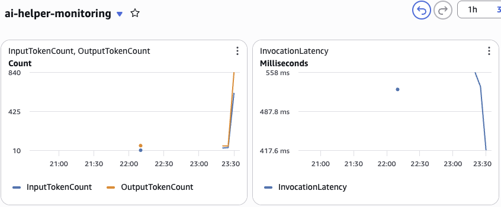

**11. Alarm preview: the 5,000 token threshold against actual usage**
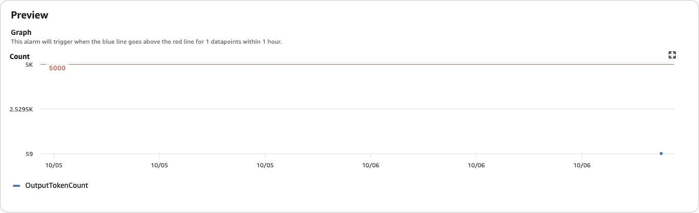

**12. The `ai-helper-token-spike` alarm, actions enabled**
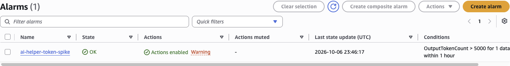

## Troubleshooting
- **AccessDeniedException in the Playground:** my first Bedrock call failed because AWS was still verifying my new account for model access. It was an account-level check, not an IAM or code problem, so I waited instead of loosening permissions.
- **503 instead of 429 under load:** 15 parallel requests returned 10 × `200` and 5 × `503`. The 503s came from **Lambda's concurrency limit**: new accounts can run only 10 copies at once. API Gateway's throttle hadn't triggered. I confirmed the stage settings with `aws apigatewayv2 get-stage` (burst 5, rate 2, AutoDeploy true). A longer test of 40 requests, 10 at a time, then returned `429`s. AWS applies throttling on a best-effort basis, so small bursts can slip through.

## What I learned
- **Tokens are the bill.** Every request is priced on input and output tokens, so the main cost controls are choosing a small model, capping input and output size, and limiting request rate.
- **Least privilege applies to AI too.** The function can call one model and nothing else, so it can't be used to run up charges on expensive models.
- **Throttling is a speed bump, not a budget.** API Gateway limits are approximate, so an alarm on actual usage is the real safety net.
- **Two limits, two error codes:** `429` means API Gateway throttled the request, and `503` means the backend (Lambda concurrency) was full.
- **Observability comes free if you use it.** Bedrock publishes token and latency metrics to CloudWatch automatically, and one structured log line per call makes each request searchable.
- **Cleanup:** when I finished, I deleted the HTTP API, Lambda function, IAM role, alarm, dashboard and SNS topic, so nothing keeps running or costing money.
