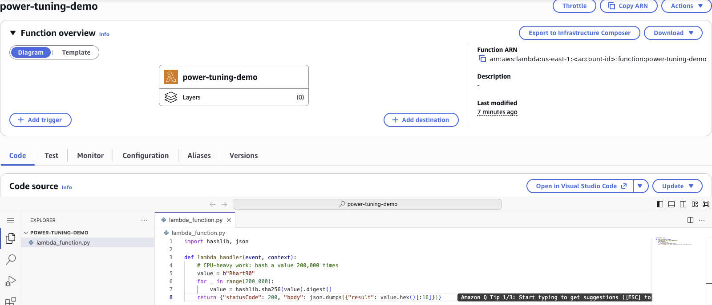
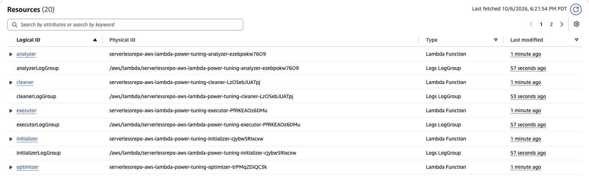
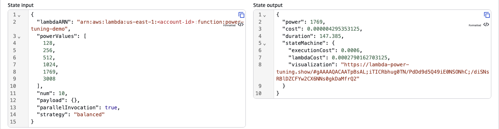
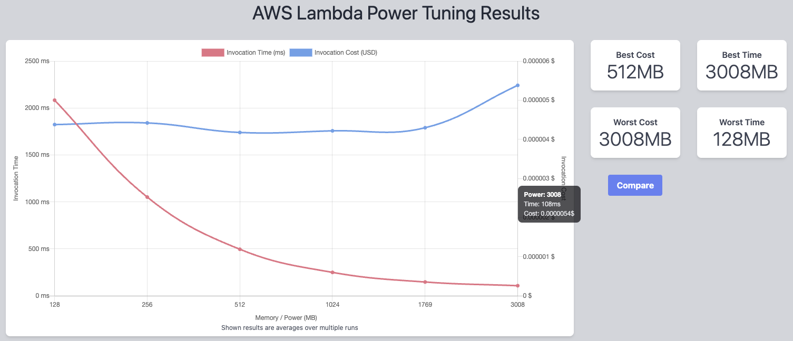
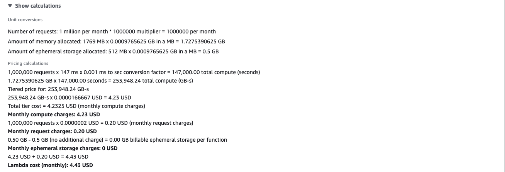
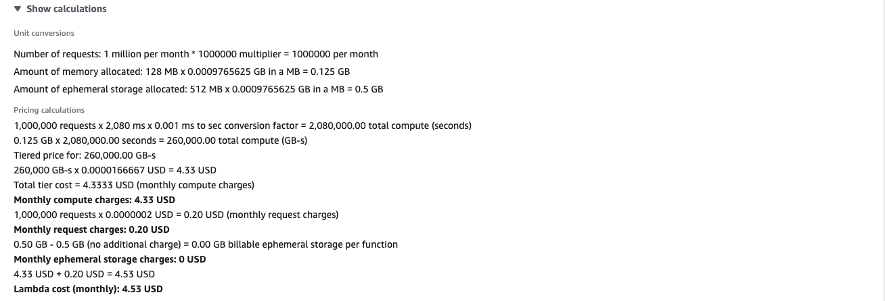
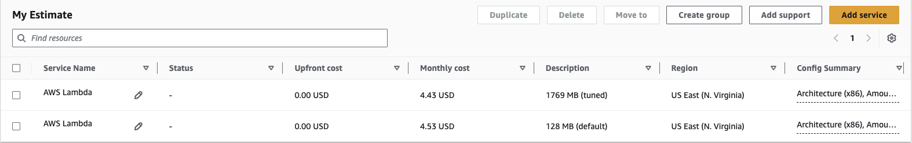

# Lambda Power Tuning and Cost Analysis

### Objective
Find the right memory size for a Lambda function using data instead of guesswork, then turn the result into a monthly cost with the AWS Pricing Calculator. Connect the outcome to two Well-Architected pillars: Performance Efficiency and Cost Optimization.

### What I did
In my own AWS account, I created a CPU-heavy Python Lambda function and deployed the open-source **AWS Lambda Power Tuning** tool from the Serverless Application Repository. I ran it against my function at six memory sizes (128 MB to 3008 MB), 10 runs each, and read the speed-versus-cost chart it produced. Then I priced the tuned setting and the default setting in the AWS Pricing Calculator for 1 million requests a month. Finally, I deleted everything.

### Services I learned
- **AWS Lambda**: memory settings, how memory also sets CPU, and GB-second billing
- **AWS Step Functions**: the state machine that runs the tuning workflow
- **AWS Serverless Application Repository (SAR)**: deploying a ready-made serverless app in a few clicks
- **AWS CloudFormation**: the stack SAR creates, and deleting it to clean up in one step
- **AWS Pricing Calculator**: building and comparing a cost estimate

## Result

| | 128 MB (default) | 1769 MB (tuned) |
|---|---|---|
| Average duration | ~2,080 ms | 147 ms |
| Monthly cost (1M requests, us-east-1) | **$4.53** | **$4.43** |

**The tuned setting is 14 times faster and costs slightly less.** Lambda bills memory × time (GB-seconds). Giving the function 14 times more memory made it finish 14 times sooner, so the bill stayed flat while users get answers in 0.15 seconds instead of 2 seconds.

The full run of the tuning tool itself cost less than a tenth of a cent.

## How it works
```
Step Functions state machine (Power Tuning tool)
   │
   ├─ Initializer  ── creates a version of my function for each memory size
   ├─ Executor     ── invokes each version 10 times, in parallel
   ├─ Cleaner      ── deletes the temporary versions
   ├─ Analyzer     ── averages duration and cost per memory size
   └─ Optimizer    ── picks the best size for the chosen strategy ("balanced")
          │
          ▼
   output: best power, cost, duration + a visualization link
```

## Files
- [`lambda_function.py`](lambda_function.py): the function I tuned (hashes a value 200,000 times, so it is CPU-bound)
- [`power-tuning-input.json`](power-tuning-input.json): the input I gave the state machine

## Steps
1. **Function:** created `power-tuning-demo` (Python 3.12, 128 MB, 30-second timeout) with CPU-heavy code.
2. **Tool:** deployed `aws-lambda-power-tuning` from the Serverless Application Repository. It created 20 resources through CloudFormation.
3. **Tune:** started a Step Functions execution with six memory sizes, 10 runs each, `parallelInvocation: true` and the `balanced` strategy.
4. **Read the result:** the output recommended **1769 MB** (147 ms, $0.0000043 per run) and linked to a chart.
5. **Price it:** in the AWS Pricing Calculator (without Free Tier), estimated 1 million requests a month at 1769 MB / 147 ms and at 128 MB / 2,080 ms.
6. **Clean up:** deleted the CloudFormation stack, the function and its role.

## Screenshots

**1. The CPU-heavy function I tuned**


**2. Power Tuning tool deployed from the Serverless Application Repository (20 resources)**


**3. Step Functions input and output: 1769 MB recommended, 147 ms per run**


**4. The tuning chart: time drops sharply while cost per run stays nearly flat until 3008 MB**


**5. Pricing Calculator: 1769 MB costs $4.43 a month for 1 million requests**


**6. Pricing Calculator: the 128 MB default costs $4.53 a month**


**7. The estimate side by side**


## Well-Architected pillars
- **Performance Efficiency:** "use data to select resources." Instead of guessing a memory size, I measured six options under the same load. Since Lambda gives CPU in proportion to memory (one full vCPU at 1,769 MB), a CPU-bound function speeds up almost linearly as memory grows.
- **Cost Optimization:** "measure efficiency and pay only for what you need." The cheapest setting per run (512 MB) and the fastest (3008 MB) were not the best value. 3008 MB cost about 25% more per run than 1769 MB for only 40 ms more speed. The balanced choice gives nearly top speed at nearly the lowest cost.
- **How they interact:** the strategy you pick decides the trade-off. `cost` optimizes for the bill, `speed` for latency, and `balanced` weighs both. The right answer depends on the workload: a user-facing API should lean toward speed, and a nightly batch job toward cost.

## What I learned
- **More memory can be cheaper.** Lambda charges for memory × duration. If extra memory makes code finish proportionally faster, the cost stays the same or drops.
- **Memory is also CPU.** You can't set Lambda CPU directly; raising memory is how you get more of it.
- **It depends on the code.** CPU-bound code (like this hashing loop) benefits most. Code that mostly waits on a database or API won't speed up, so tuning would point to a small memory size. That's why you measure each function.
- **Pricing Calculator traps:** the request unit defaults to "per month" (not millions), and the "Include Free Tier" option can hide the real cost. I compared both settings without Free Tier.
- **Cleanup:** SAR apps are CloudFormation stacks, so one stack delete removed all 20 tool resources.
