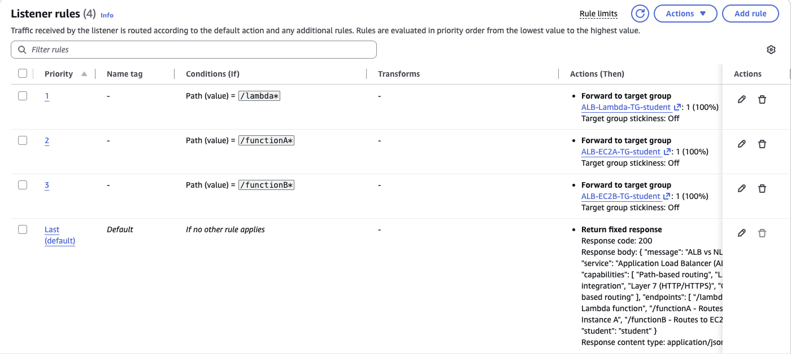
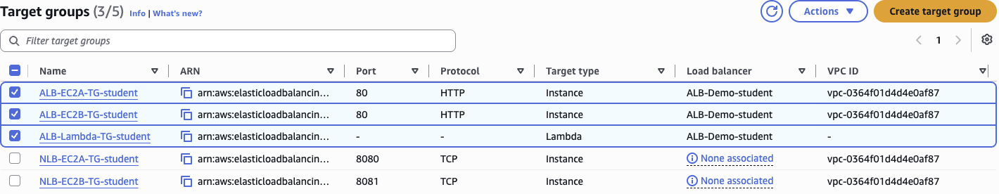
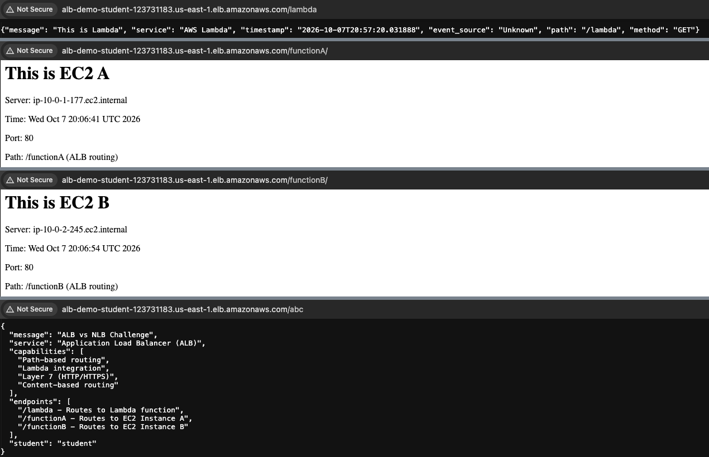
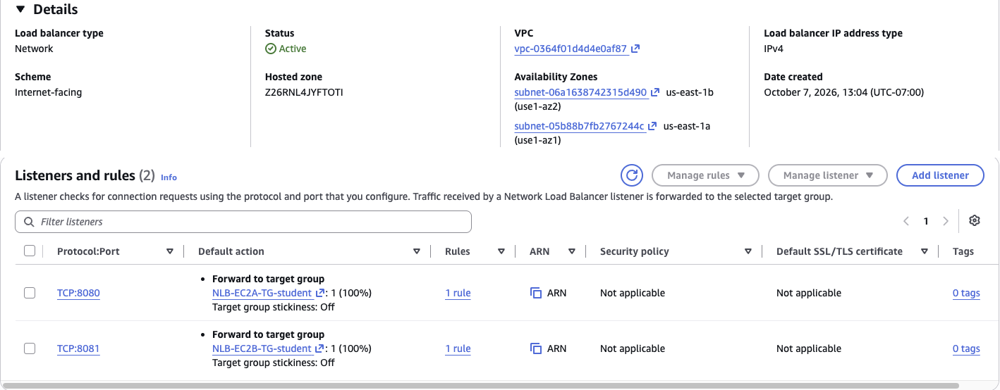
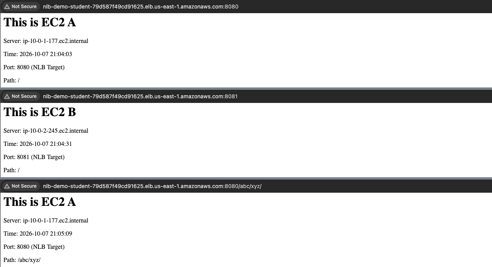
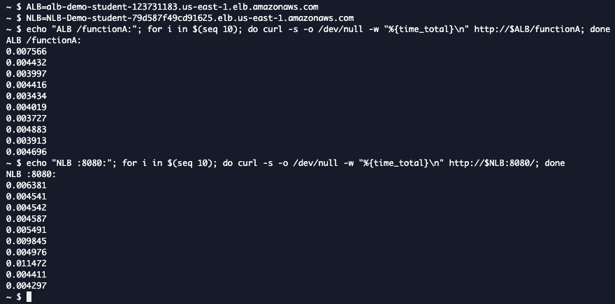
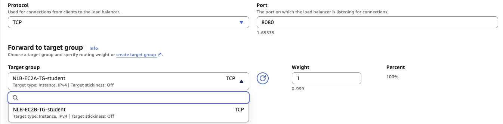

# ALB vs NLB: Layer 7 vs Layer 4 Load Balancing

### Objective
Learn the practical difference between an Application Load Balancer (ALB) and a Network Load Balancer (NLB) by configuring both in front of the same servers, then testing what each one can and can't do.

### What I did
In a course lab account with two EC2 web servers, a Lambda function, an ALB and an NLB already deployed, I added **path-based rules** to the ALB (`/lambda`, `/functionA`, `/functionB`) and **port-based listeners** to the NLB (TCP 8080 and 8081). I tested every route in the browser, proved the NLB ignores the URL path, compared response times from CloudShell, and confirmed that an NLB can't send traffic to Lambda.

### Services I learned
- **Elastic Load Balancing (ALB)**: Layer 7 listener rules, priorities, a fixed-response default rule, Lambda targets
- **Elastic Load Balancing (NLB)**: Layer 4 TCP listeners and port-based routing
- **Target groups**: instance vs Lambda target types, health checks
- **Amazon EC2**: two Apache web servers in different Availability Zones
- **AWS Lambda**: as an ALB target
- **AWS CloudShell**: measuring latency with `curl`

## Architecture
```
                       ┌── /lambda*    ──► Lambda function
client ──► ALB :80 ────┼── /functionA* ──► EC2 A
 (Layer 7: reads path) ├── /functionB* ──► EC2 B
                       └── anything else ► fixed JSON response

client ──► NLB ─────────── TCP :8080 ──► EC2 A
 (Layer 4: reads port) └── TCP :8081 ──► EC2 B      (no Lambda option)
```

## Steps
1. **ALB rules:** on the HTTP:80 listener, added three path rules with priorities 1–3, each forwarding to its own target group.
2. **Health checks:** confirmed both EC2 targets were healthy. Health checks on the Lambda target group are off, because each check would be a billed Lambda invocation.
3. **Test the ALB:** the same host and port returned Lambda, EC2 A or EC2 B depending on the path, and `/abc` fell through to the default rule.
4. **NLB listeners:** added TCP:8080 → EC2 A and TCP:8081 → EC2 B.
5. **Test the NLB:** each port reached a different server, and `:8080/abc/xyz/` **still** reached EC2 A, because the NLB never looks at the path.
6. **Compare latency:** sent 10 requests to each from CloudShell.
7. **Lambda on the NLB:** opened the NLB listener's target group list. The Lambda target group isn't offered.

## Results

| | ALB | NLB |
|---|---|---|
| OSI layer | 7 (HTTP/HTTPS) | 4 (TCP/UDP/TLS) |
| Routes by | Path, host, headers, query string, method | Port (and protocol) only |
| How I reached 2 servers | Different **paths** on port 80 | Different **ports** (8080, 8081) |
| Unknown path `/abc` | Default rule (fixed JSON) | Ignored, still reached EC2 A |
| Lambda target | ✅ Yes | ❌ Not possible |
| Median latency (my test) | 4.2 ms | 4.8 ms |

## Screenshots

**1. ALB listener rules: three paths, three target groups, plus the default rule**


**2. Target groups: the ALB groups use HTTP (one is a Lambda type); the NLB groups use TCP on 8080/8081**


**3. ALB path routing: `/lambda`, `/functionA`, `/functionB`, and `/abc` hitting the default rule**


**4. The NLB ("Network" type) with TCP:8080 and TCP:8081 listeners**


**5. NLB port routing: 8080 → EC2 A, 8081 → EC2 B, and `/abc/xyz/` on 8080 still → EC2 A**


**6. Latency from CloudShell, 10 requests each**


**7. Editing an NLB listener: only instance target groups are offered, no Lambda**


## Troubleshooting and surprises
- **The lab doc's NLB test URLs said "YOUR ALB DNS NAME".** That's a typo: the port tests need the **NLB** DNS name. The ALB has no listeners on 8080 or 8081.
- **The NLB wasn't faster in my test.** I expected the NLB to win because it doesn't inspect HTTP. Both medians were 4–5 ms from inside the same region, so the difference was lost in normal network jitter. The NLB's advantage shows at very high connection volumes and for non-HTTP traffic, not in 10 requests.
- **The EC2 page shows the path on the NLB too.** That's the web server reading the request, not the NLB. The NLB forwarded the TCP connection without looking at it.

## What I learned
- **Layer 7 vs Layer 4 in one sentence:** the ALB reads the request and decides, while the NLB only looks at the address and port and passes the connection through.
- **Pick the ALB** for web apps and microservices: path and host routing on one port, Lambda targets, redirects, fixed responses, WAF and authentication.
- **Pick the NLB** for raw performance and non-HTTP traffic: TCP/UDP (gaming, IoT, databases), millions of connections, **static IPs per AZ** (useful when a client must allowlist IPs), and preserving the client's source IP.
- **Use both together** when you need static IPs and path routing: put an NLB in front of an ALB (an ALB-type target group).
- **Cost:** cross-zone traffic is free on an ALB but billed on an NLB when cross-zone load balancing is turned on.
- **Measure, don't assume.** My latency test didn't match the textbook, and understanding why was the most useful part of the lab.
