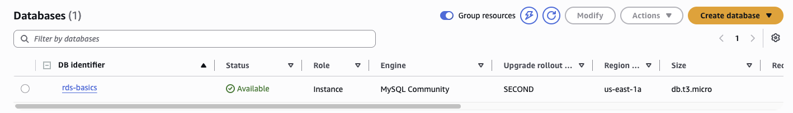
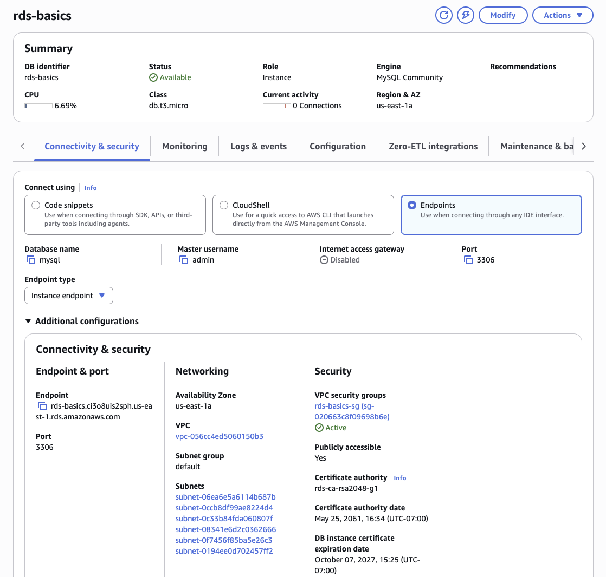
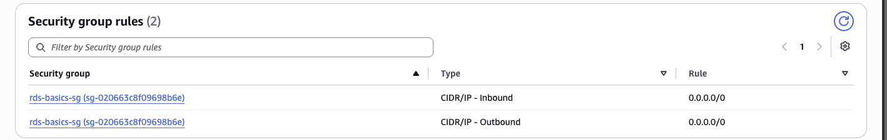
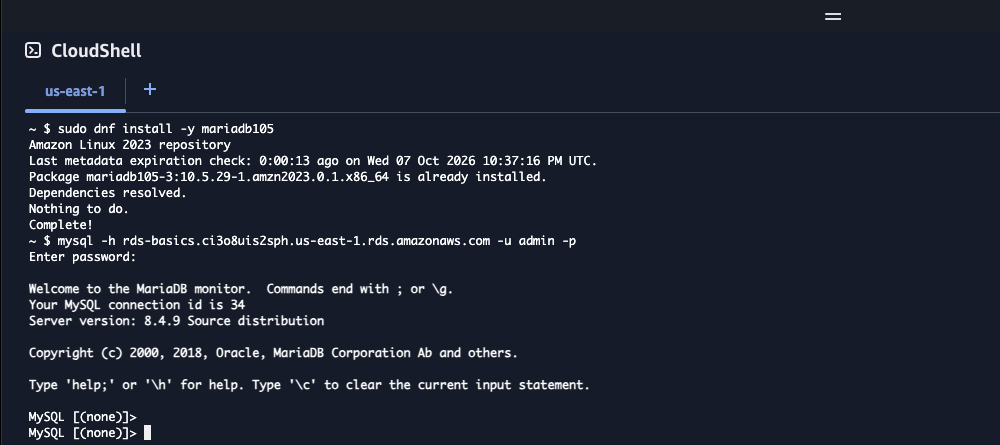
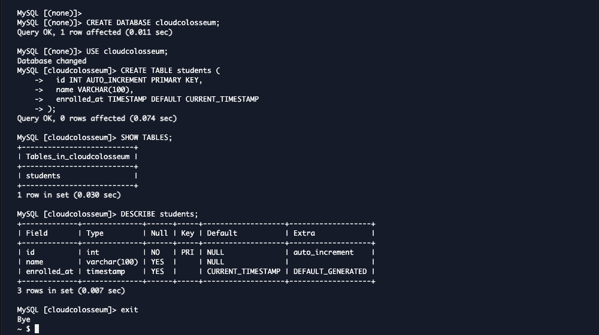

# RDS Basics: Your First Relational Database

### Objective
Launch a managed MySQL database on Amazon RDS, connect to it from the command line, and define a table schema with SQL. Then compare the experience with DynamoDB from lab 4.

### What I did
I created a **db.t3.micro MySQL 8.4** instance with 20 GiB of gp2 storage in a single Availability Zone. I attached a pre-built security group that opens port 3306 and made the instance publicly reachable. Once it was **Available**, I installed the MySQL client in **CloudShell**, connected using the instance endpoint, and created a database and a `students` table, then checked its structure.

### Services I learned
- **Amazon RDS for MySQL**: engine, template, instance class, storage, credentials, connectivity
- **Amazon VPC**: security groups (port 3306), subnet groups, public accessibility
- **Amazon EBS**: the gp2 volume behind RDS storage
- **AWS CloudShell**: installing `mariadb105` and connecting with `mysql`
- **SQL (DDL)**: `CREATE DATABASE`, `CREATE TABLE`, `SHOW TABLES`, `DESCRIBE`

## Architecture
```
CloudShell (mysql client)
      │  TCP 3306 over the internet
      ▼
rds-basics-sg  (inbound 3306 allowed)
      │
      ▼
RDS MySQL 8.4 · db.t3.micro · Single-AZ (us-east-1a)
      └── 20 GiB gp2 EBS volume
          └── database: cloudcolosseum
              └── table: students (id, name, enrolled_at)
```

## Steps
1. **Create database → Full configuration.** Easy create hides the settings that need changing.
2. **Engine: MySQL**, not Aurora. Most companies moving from on-premises MySQL land on RDS MySQL first.
3. **Template: Sandbox, Single-AZ.** Production and Dev/Test default to larger, more expensive instances and Multi-AZ.
4. **Settings:** identifier `rds-basics`, master user `admin`, self-managed password.
5. **Instance class:** Burstable → **db.t3.micro**. The console defaults to db.m7g.large, which the lab policy denies.
6. **Storage:** gp2, 20 GiB, autoscaling **off**.
7. **Connectivity:** Public access **Yes**, and swapped the default security group for **rds-basics-sg**.
8. **Waited about 5–10 minutes** for the status to go from Creating to **Available**.
9. **Checked the connection details:** endpoint, port 3306, Publicly accessible = Yes.
10. **CloudShell:** ran `sudo dnf install -y mariadb105`, then `mysql -h <endpoint> -u admin -p`.
11. **Ran the SQL** in [`schema.sql`](schema.sql), then typed `exit`.

## Screenshots

**1. The instance is Available: MySQL Community on db.t3.micro in us-east-1a**


**2. Connectivity: endpoint and port 3306, Publicly accessible = Yes, rds-basics-sg active**


**3. Security group rules on the instance (open to 0.0.0.0/0 for the lab only)**


**4. Client installed and connected from CloudShell (server version 8.4.9)**


**5. Database and table created, with `SHOW TABLES` and `DESCRIBE students` verifying the schema**


## Troubleshooting and surprises
- **The instance class defaults to db.m7g.large.** You have to change it to db.t3.micro by hand, or creation is denied. In a real account, the larger default would quietly cost far more.
- **The Connect section has three views.** The newer console opens on *Code snippets*. "Publicly accessible" only appears under **Endpoints** (or the Configuration tab). The snippet's `--ssl-mode=VERIFY_IDENTITY` command is the more secure way to connect from a laptop.
- **Use CloudShell from the top toolbar.** The CloudShell option inside RDS's Connect menu starts a VPC-based environment that needs extra permissions.
- **The client calls itself "MariaDB monitor".** On Amazon Linux 2023, the MySQL client package is `mariadb105`. MariaDB is a MySQL fork, and its client works with MySQL 8.4.
- **A hanging connection usually means networking.** Check public access and the security group's port 3306 rule before suspecting the password.

## What I learned
- **RDS runs on servers I choose and pay for.** DynamoDB had no instance to choose. Here I picked an instance class and a storage size, and I pay for the whole instance even when the database is mostly idle. AWS still handles the operating system, patching, backups and failover.
- **Schema vs schemaless:** RDS needed a table structure before any data, so a row with an unknown column fails. DynamoDB only needs the key, and each item can have different attributes.
- **The trade-off:** RDS took more setup but gives full SQL, with joins, transactions and queries across related tables. DynamoDB is faster to start and scales without servers, but it's built for known access patterns. Choose based on the data's shape and how it will be queried.
- **Connect by endpoint, never by IP.** The DNS name stays the same when AWS replaces the host during maintenance or a Multi-AZ failover.
- **Production would look different:** Public access off, the database in private subnets, the security group allowing 3306 only from the app tier's security group, **Multi-AZ** for high availability, credentials in **Secrets Manager**, and encryption at rest with KMS.
- **Backups:** automated backups and point-in-time restore work with InnoDB, MySQL's default storage engine.
