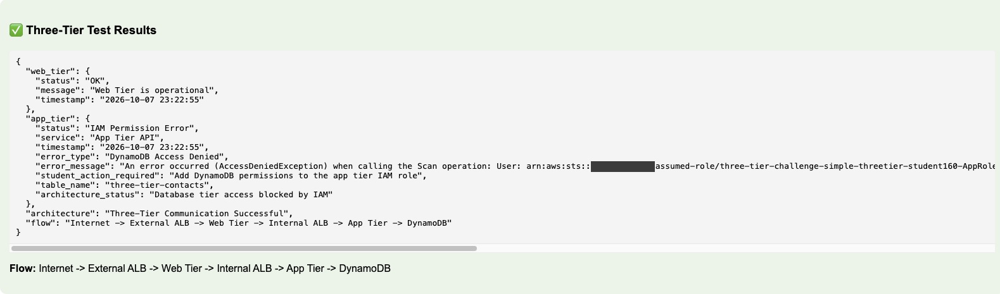
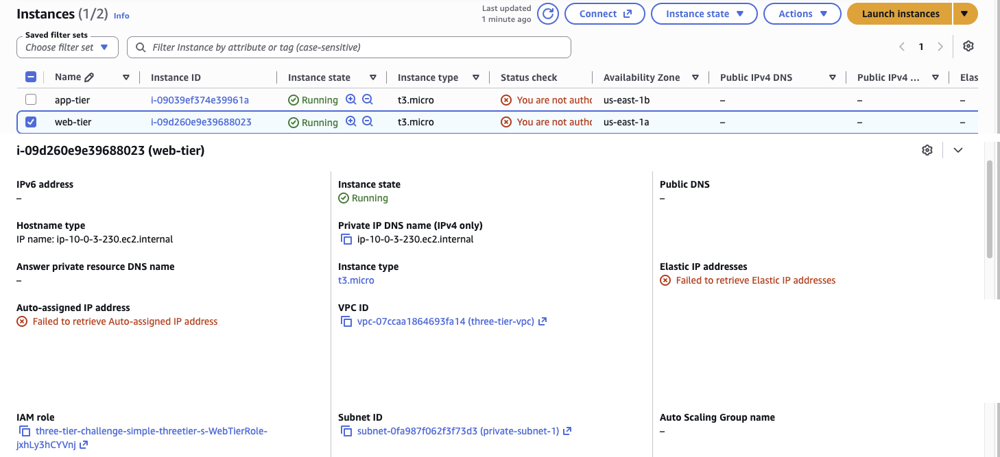
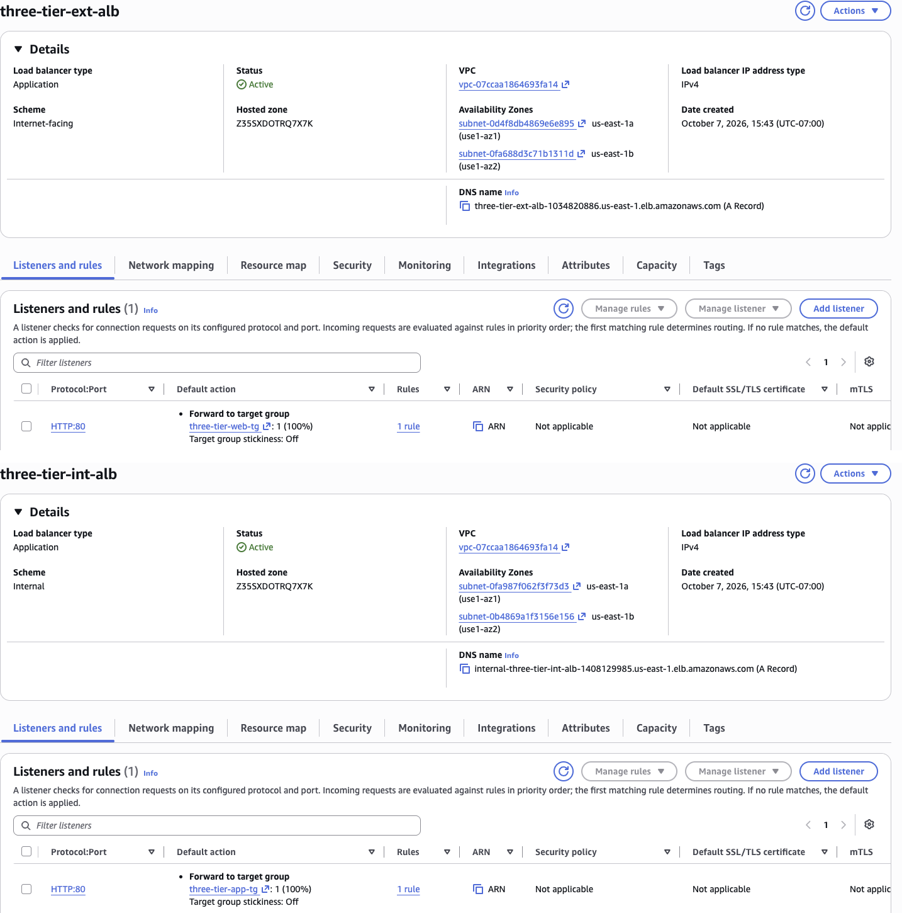
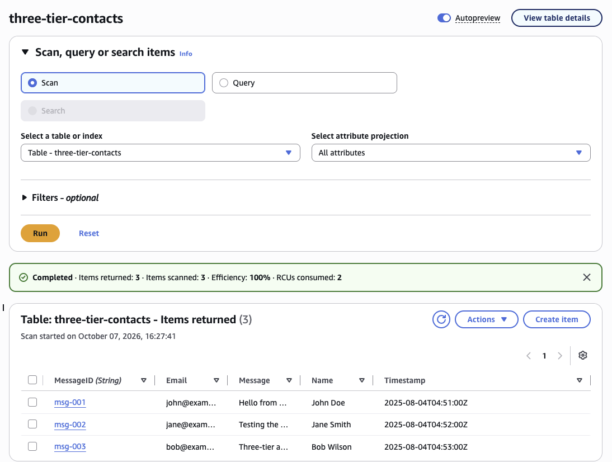
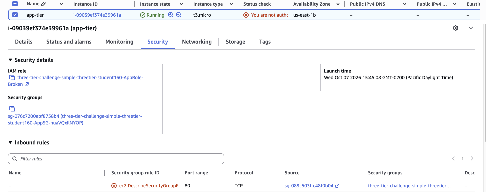
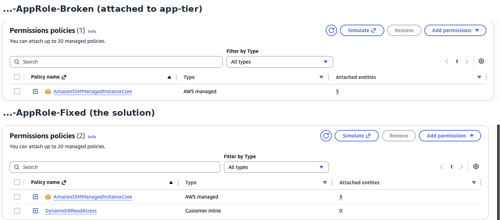
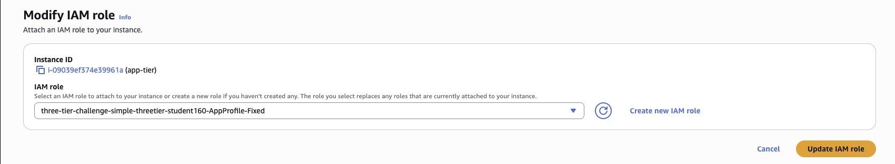
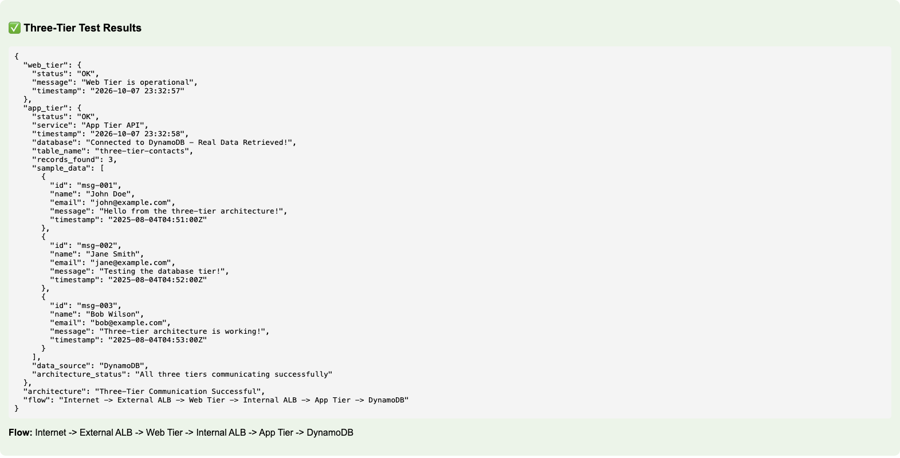
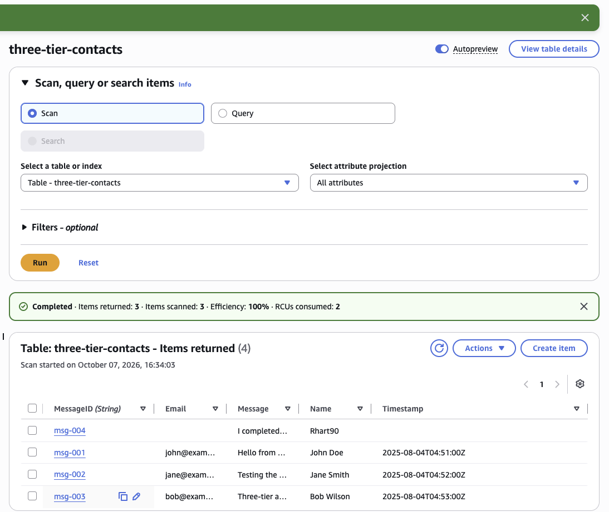
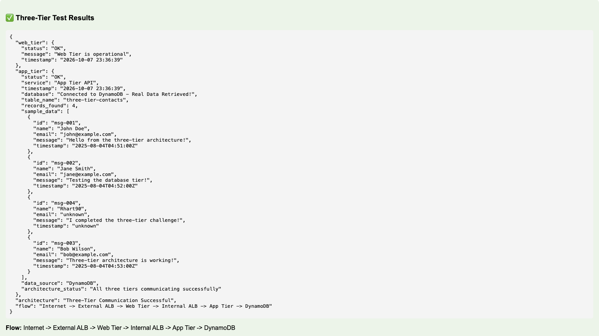

# Three-Tier Architecture: Debugging a Broken Data Tier

### Objective
Understand how a classic three-tier web application is built on AWS (presentation, application and data tiers) and how its security layers fit together. Then troubleshoot why the app tier couldn't read its database and fix it with least-privilege IAM.

### What I did
In a course lab account with the architecture already deployed, I traced a request through every tier. I confirmed that both EC2 servers sit in **private subnets** behind an **internet-facing ALB** and an **internal ALB**, and I read the error the app returned. The cause was that the app server's IAM role had no DynamoDB permissions. I compared the attached **AppRole-Broken** with the prepared **AppRole-Fixed** and swapped the instance profile on the running server, with no restart. Then I verified the full flow and added my own record to the table to prove the app reads live data.

### Services I learned
- **Amazon VPC**: public vs private subnets, security groups that reference other security groups
- **Elastic Load Balancing**: internet-facing vs internal Application Load Balancers
- **Amazon EC2**: web and app servers in private subnets across two AZs
- **AWS IAM**: roles, instance profiles, AWS managed vs inline policies, least privilege
- **Amazon DynamoDB**: the data tier, Scan, schemaless items
- **AWS Systems Manager**: why both roles include `AmazonSSMManagedInstanceCore`

## Architecture
```
User ──HTTP:80──► External ALB (internet-facing, public subnets)
                        │
                        ▼
                  Web tier EC2 (private subnet, us-east-1a)
                        │
                        ▼
                  Internal ALB (internal, private subnets)
                        │
                        ▼
                  App tier EC2 (private subnet, us-east-1b)
                        │  IAM role (AppRole-Fixed)
                        ▼
                  DynamoDB: three-tier-contacts

Security groups chain the tiers:
  External ALB SG : 80 from 0.0.0.0/0
  Web tier SG     : 80 only from External ALB SG
  Internal ALB SG : 80 only from Web tier SG
  App tier SG     : 80 only from Internal ALB SG
App tier → DynamoDB is controlled by IAM (the instance's role), not security groups.
```

## Steps
1. **Reproduce the problem:** the website's **Test Full Three-Tier Flow** returned `web_tier: OK` but `app_tier: IAM Permission Error` with **AccessDeniedException** on DynamoDB **Scan**. The network path worked, and the permission didn't.
2. **Web tier:** in EC2, the `web-tier` instance is in **private-subnet-1** with no public IP or DNS. Only the ALB can reach it.
3. **Load balancers:** `three-tier-ext-alb` is **Internet-facing** and forwards to the web target group. `three-tier-int-alb` is **Internal** (its DNS name starts with `internal-`) and forwards to the app target group.
4. **Data tier:** DynamoDB table `three-tier-contacts` (partition key `MessageID`, on-demand) holds 3 sample contacts.
5. **Diagnose:** the `app-tier` instance's Security tab showed **…AppRole-Broken**. Its inbound rule allows port 80 only from the internal ALB's security group.
6. **Compare roles in IAM:** Broken has only `AmazonSSMManagedInstanceCore`. Fixed adds an inline **DynamoDBReadAccess** policy (GetItem, Scan, Query on the table).
7. **Fix:** EC2 → app-tier → Actions → Security → **Modify IAM role** → `…AppProfile-Fixed` → Update. There was no reboot. The instance picks up new temporary credentials automatically.
8. **Verify:** the same test now returns "Connected to DynamoDB - Real Data Retrieved!" and "All three tiers communicating successfully."
9. **Add data:** I created `msg-004` with only Name and Message. The website then showed **4 records**, and my item displayed "unknown" for the fields it doesn't have.

## Screenshots

**1. Before: the web tier is OK, but the app tier is denied DynamoDB Scan (account ID redacted)**


**2. Both servers have no public IP; web-tier is in private-subnet-1**


**3. External ALB (Internet-facing → web target group) vs Internal ALB (Internal, `internal-` DNS → app target group)**


**4. The data tier: three-tier-contacts with 3 sample items**


**5. The app-tier instance is using AppRole-Broken, and only the internal ALB's security group can reach it on port 80**


**6. The diagnosis: the Broken role has SSM only; the Fixed role adds DynamoDBReadAccess**


**7. The fix: swapping the instance profile to AppProfile-Fixed**


**8. After: real data retrieved, all three tiers communicating**


**9. Adding my own item, msg-004, with only Name and Message**


**10. The website now returns 4 records, including mine, read live from DynamoDB**


## Troubleshooting and surprises
- **"Three-Tier Communication Successful" appeared even in the broken state.** That line only means the network path worked. The real status was inside `app_tier`. You have to read the whole response, not the headline.
- **Read the error message for the answer.** `AccessDeniedException … assumed-role/…AppRole-Broken` named the action (Scan), the service (DynamoDB) and the identity (the role). That was the whole diagnosis.
- **IAM, not security groups, controls DynamoDB.** DynamoDB is reached through the AWS API, not inside the VPC, so no security group rule could have fixed this.
- **Roles attach to EC2 through instance profiles.** That's why the dropdown listed `AppProfile-*` and not `AppRole-*`.
- **The lab account's console role is read-limited.** Red "not authorized" banners on volumes, Elastic IPs and Compute Optimizer were expected noise.
- **DynamoDB "Item count 0" is not live.** It's refreshed about every 6 hours. Explore items showed the real 3 rows.

## What I learned
- **Three tiers, three jobs:** presentation (web), logic (app) and data (database). Each one can scale, be secured and be changed on its own.
- **Only the load balancer is public.** Both servers live in private subnets, and the internal ALB is unreachable from the internet. That shrinks the attack surface to one entry point.
- **Security groups can reference other security groups.** Each tier only accepts traffic from the tier in front of it, with no IP ranges to maintain.
- **Least privilege in practice:** the fix gave the app read-only access (GetItem, Scan, Query) on one table, not `dynamodb:*` on everything.
- **Roles beat keys:** the instance gets rotating temporary credentials from its role, so there are no access keys stored on the server, and a role swap takes effect without a restart.
- **Mix and match services:** the same pattern works with Lambda instead of EC2 in the app tier, or RDS instead of DynamoDB in the data tier.
