# High Availability and Auto Scaling: A Three-Tier App Under Load

### Objective
Turn a single-server three-tier app into one that survives an Availability Zone failure and grows and shrinks with demand. Then prove it by loading the servers and watching Auto Scaling react.

### What I did
In a course lab account with the three-tier app already deployed behind Auto Scaling groups, I first made the web tier **highly available** by raising its minimum from 1 to 2. AWS launched a second server in a different AZ. Next I read the **simple scaling policies** and the **CloudWatch alarms** that drive them. Then I started a CPU stress test from the website and watched both tiers scale out to their maximum of 3. New servers joined the load balancer as Unhealthy and turned Healthy once they booted. Finally I stopped the load and watched the app tier scale back in from 3 to 1. Every step is recorded in the groups' **Activity history**.

### Services I learned
- **Amazon EC2 Auto Scaling**: Auto Scaling groups, launch templates, min/desired/max, simple scaling policies, cooldowns, AZ balancing
- **Amazon CloudWatch**: metric alarms on average `CPUUtilization`, alarm states, datapoints to alarm
- **Elastic Load Balancing**: target groups, health checks, new targets registering automatically
- **Amazon EC2**: instances spread across `us-east-1a` and `us-east-1b`
- **Amazon DynamoDB**: the data tier, which is multi-AZ by design

## Architecture
```
User ──► External ALB (multi-AZ)
              │
              ▼
        Web tier ASG   min 2 · desired 2 · max 3   (us-east-1a + us-east-1b)
              │
              ▼
        Internal ALB (multi-AZ)
              │
              ▼
        App tier ASG   min 1 · desired 1 · max 3
              │
              ▼
        DynamoDB (multi-AZ by default)

Each ASG has two CloudWatch alarms and two simple scaling policies:
  high_cpu : average CPU > 50% for 1 of 1 one-minute datapoints  → ScaleUpPolicy   (+1 instance)
  low_cpu  : average CPU < 30% for 5 of 5 one-minute datapoints  → ScaleDownPolicy (-1 instance)
  Cooldown : 120 seconds after each scaling action
```

## Steps
1. **Starting point:** the web tier ASG was **min 1, desired 1, max 3**. That's one server in one AZ, so if that AZ goes down, the whole site goes down.
2. **Make it highly available:** I edited Group size to **desired 2, min 2, max 3**. The ASG launched a second `web-tier-asg` instance in **us-east-1a**, while the first was in **us-east-1b**. The ASG balances across AZs on its own.
3. **Read the scaling rules:** under Automatic scaling, each tier has a **ScaleUpPolicy** (add 1 when the high_cpu alarm fires) and a **ScaleDownPolicy** (remove 1 when low_cpu fires), each with a 120-second wait.
4. **Generate load:** I clicked **Start 5-Minute Load Test** on the website, which runs CPU stress processes on the servers that handle the request.
5. **Watch the alarms:** **app_tier_high_cpu** went **In alarm** at 02:26 UTC, first, because the app tier only had one server to spread the load across.
6. **Scale-out:** the app tier went 1 → 2 at 02:26, then 2 → 3 at 02:29 (after the cooldown). The web tier went 2 → 3 at 02:26. Both tiers reached their **max of 3**.
7. **Health checks:** the newest web target showed **Unhealthy: Health checks failed** while it was still booting, then all 3 targets were **Healthy** about 2 minutes later. The load balancer only sends traffic to targets that pass.
8. **Scale-in:** once load dropped, **app_tier_low_cpu** went In alarm at 02:36. The app tier went 3 → 2 at 02:36, then 2 → 1 at 02:39, back to its minimum.
9. **Read the evidence:** each ASG's **Activity history** lists every launch and termination with the alarm and policy that caused it.

## Screenshots

**1. Before: the web tier is 1 desired, limits 1–3, so one server in one AZ (ARN removed)**
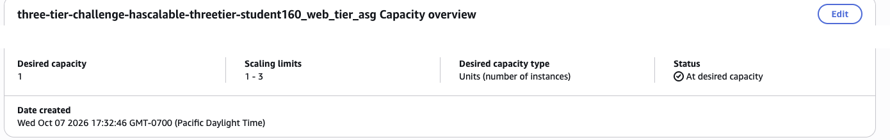

**2. Enabling HA: desired 2, min 2, max 3**
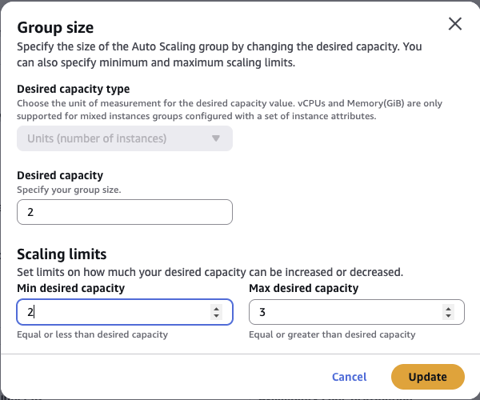

**3. Two web-tier-asg servers, one in us-east-1b and one in us-east-1a**
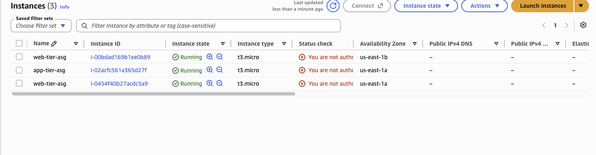

**4. The web tier's simple scaling policies: remove 1 when CPU < 30% for 5 of 5 minutes, add 1 when CPU > 50% for 1 minute, then wait 120 seconds**
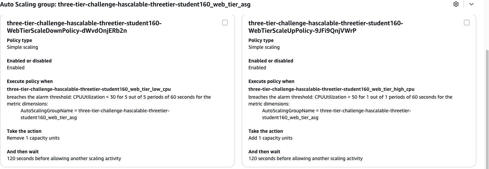

**5. The load test running CPU stress processes**
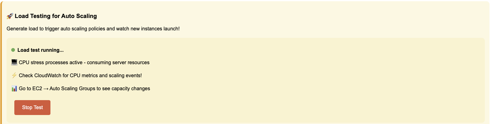

**6. The web tier's low_cpu alarm: the 30% threshold line and the CPU spike when the load test started**
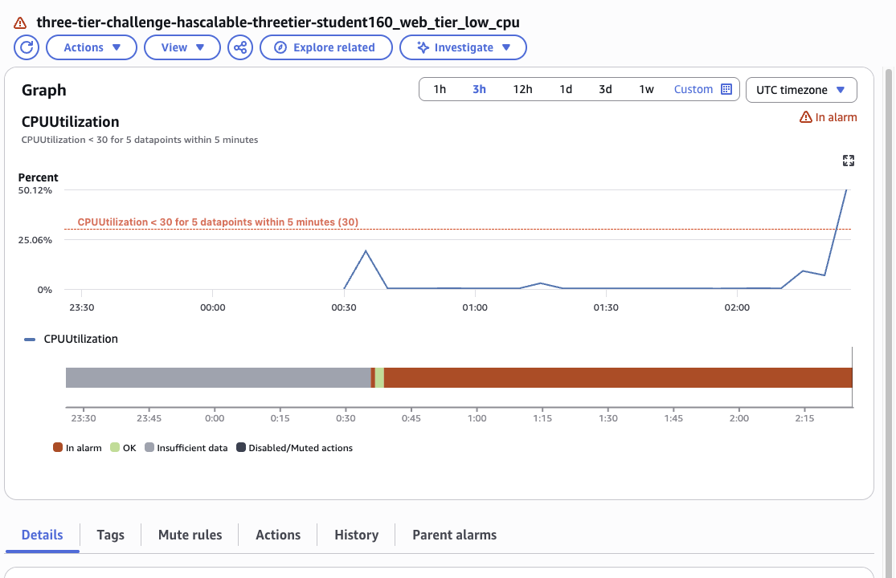

**7. app_tier_high_cpu fires first at 02:26 UTC**
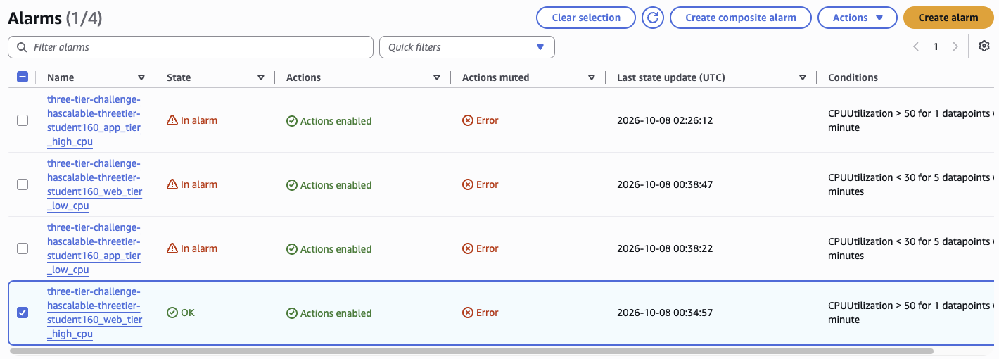

**8. Scaling out: app tier at 2, web tier at 3**


**9. The new web target is Unhealthy while it boots...**
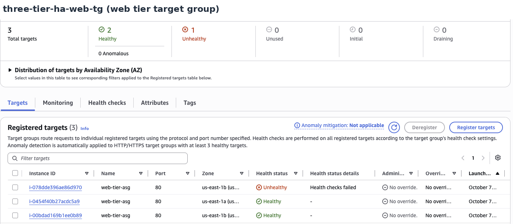

**10. ...then all 3 targets are Healthy**
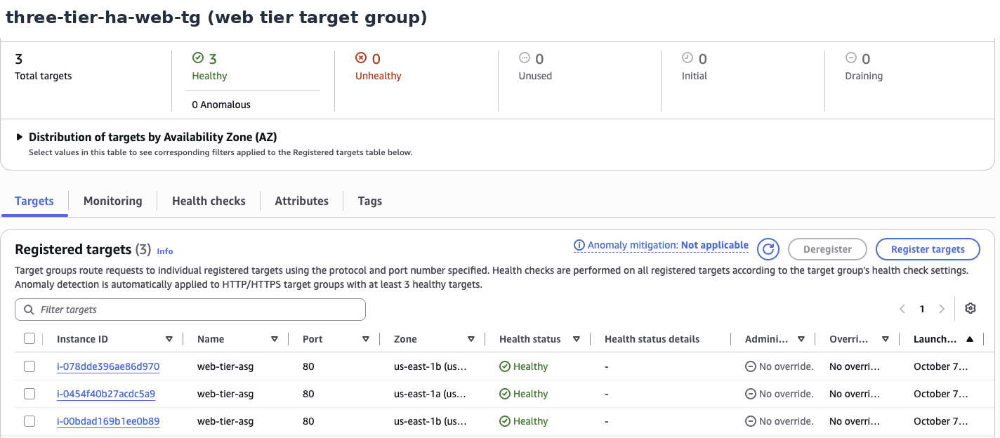

**11. Both tiers at their maximum of 3**
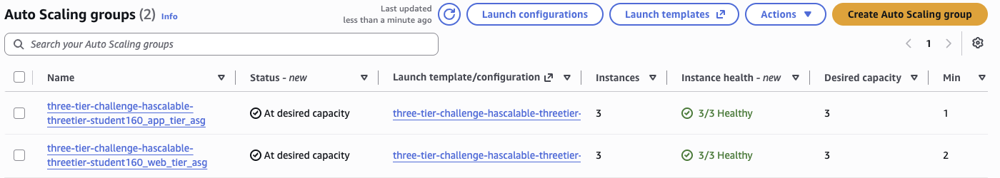

**12. Load is gone: app_tier_low_cpu is In alarm**
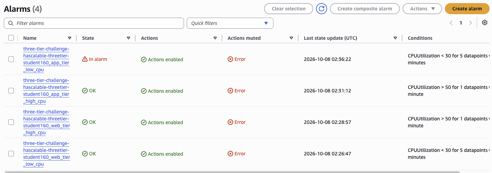

**13. The app tier is back to 1**
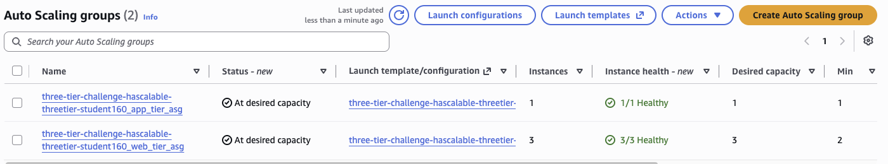

**14. App tier Activity history: 1 → 2 → 3 on high_cpu, then 3 → 2 → 1 on low_cpu**
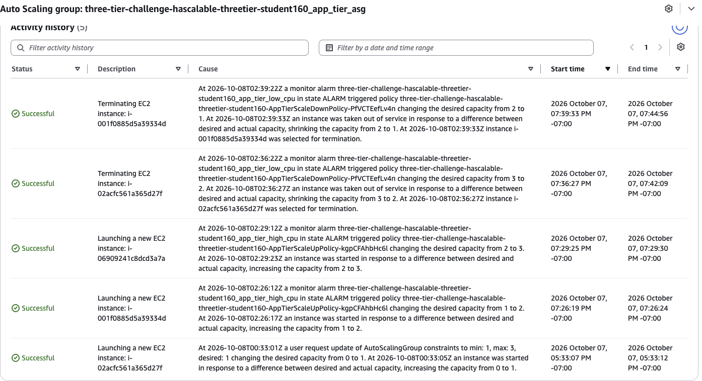

**15. Web tier Activity history: my HA change, a scale-out, a manual scale-in, and the policy scaling it right back out**
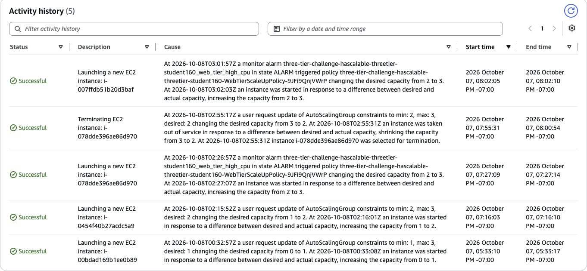

## Troubleshooting and surprises
- **The web tier wouldn't scale back in.** The app tier dropped to 1 within minutes, but the web tier stayed at 3. The stress was still running on the web servers. When I manually set desired to 2 at 02:55, the remaining servers got busier, **web_tier_high_cpu fired at 03:01, and the policy scaled it straight back to 3**. A manual change doesn't lock capacity. The policies keep reacting to real load.
- **Average CPU can hide a hot server.** With one server at 100% and two idle, the average is about 33%. That's below the 50% scale-up line but above the 30% scale-in line, so neither alarm fires. The ASG holds steady, even though one server is maxed out.
- **The website's Stop Test only reaches one server.** The load balancer sends each click to one target, so stopping the test from the browser may not stop it everywhere.
- **New targets start Unhealthy.** That's normal: the instance is still booting and installing the app. It only gets traffic after it passes health checks.
- **All the instances share one name.** Every server an ASG launches gets the same `web-tier-asg` Name tag. You tell them apart by instance ID and AZ.
- **The lab's console role is read-limited.** Red "not authorized" banners for `DescribeAccountAttributes` and `DescribeLaunchTemplateVersions` were expected noise.

## What I learned
- **High availability and scaling are different things.** HA means min ≥ 2 across AZs, so losing one AZ doesn't take the app down. Scaling means changing capacity with load. A group can do one without the other.
- **The ASG's three numbers:** min is the floor for availability, max is the ceiling for cost, and desired is the target the ASG keeps adjusting between them.
- **Alarms make the decision, and policies take the action.** CloudWatch watches the metric, and the scaling policy says how much to add or remove.
- **Scale out fast, scale in slow.** A 1-minute trigger to add and a 5-minute trigger to remove, plus a cooldown, keeps the group from flapping.
- **Auto Scaling and load balancing work as a pair.** The ASG launches and registers servers in the target group. Health checks decide when they get traffic.
- **Servers are replaceable.** Scale-in terminated the app tier's original server. That's fine, because every instance comes from the same launch template.
