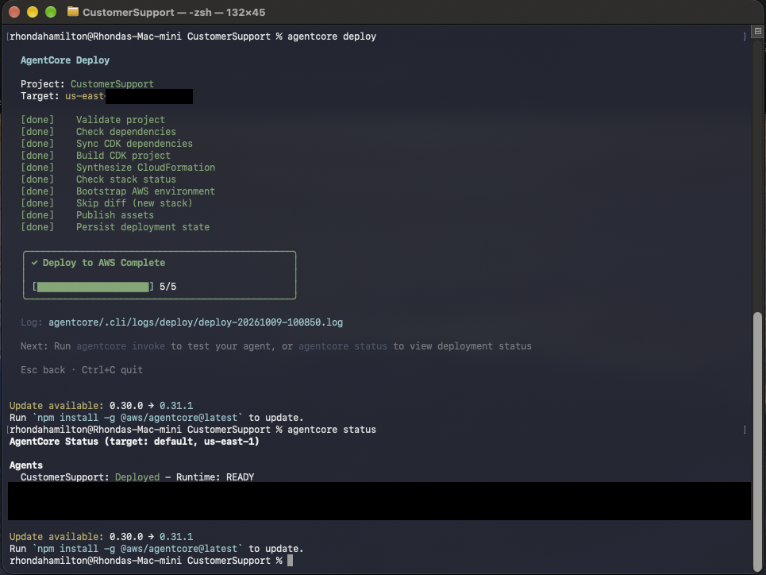
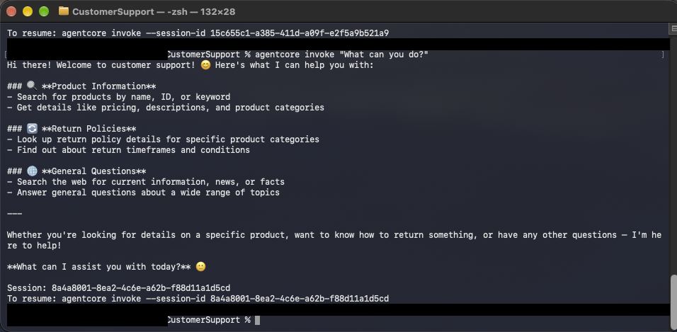
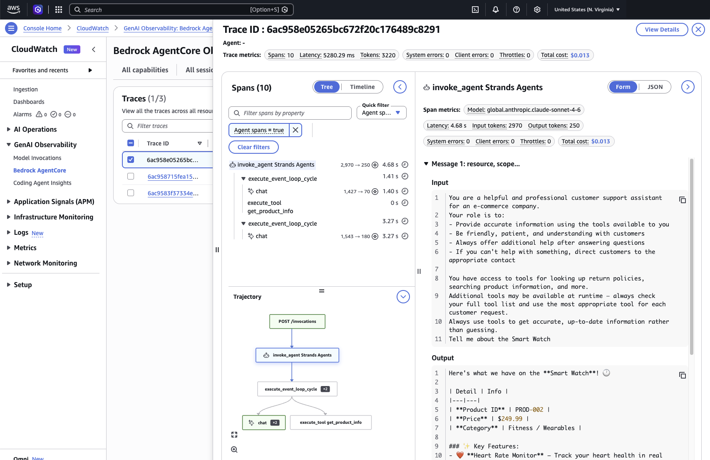
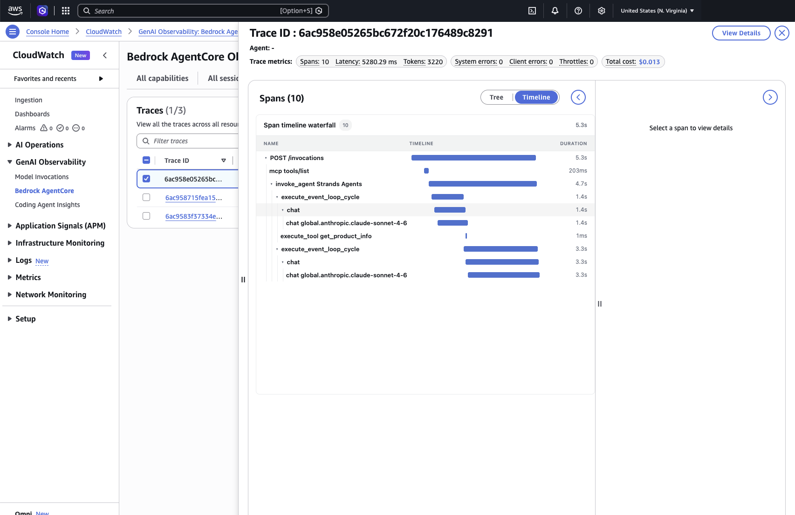
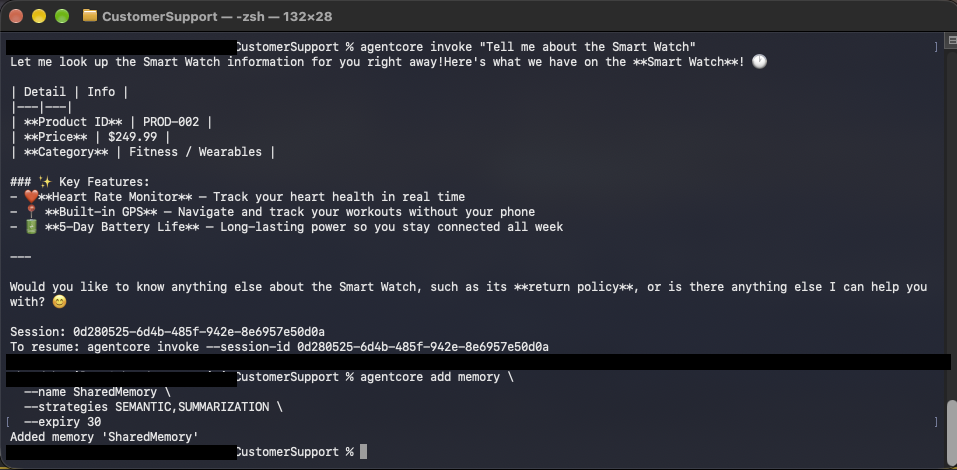
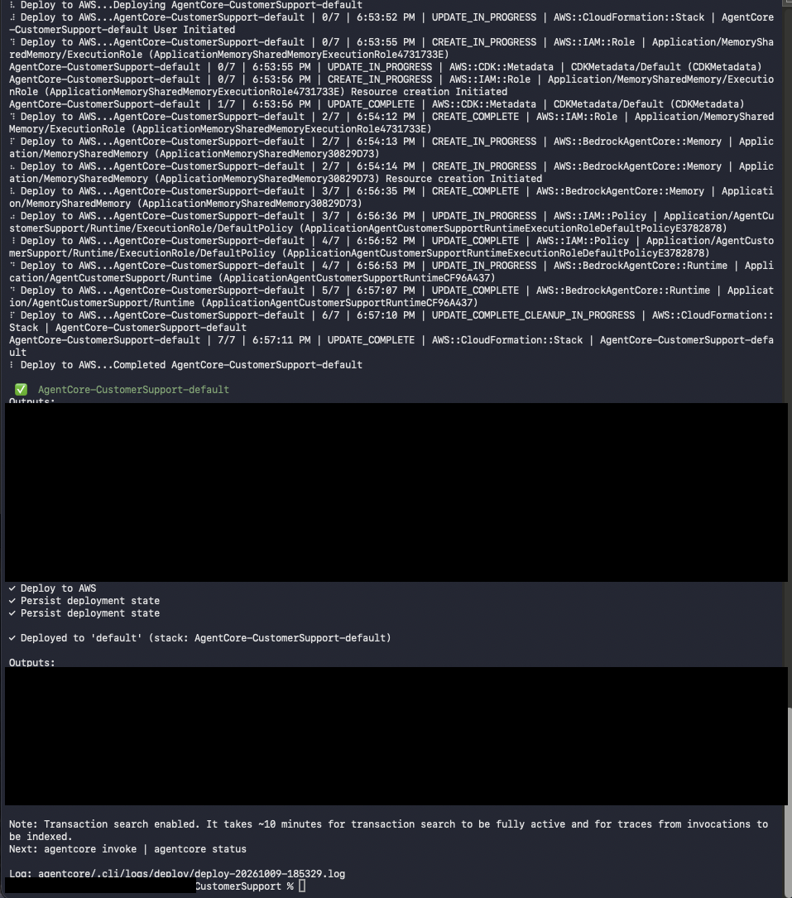
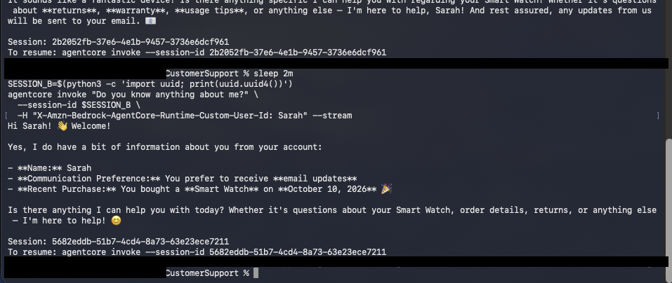

# Building a Production-Style AI Customer Support Agent on Amazon Bedrock AgentCore

### Objective
Take a Strands AI agent from a local script to a deployed, authenticated, observable, evaluated and policy-controlled customer support agent using Amazon Bedrock AgentCore. The workshop had 9 labs. This write-up covers all of them.

### What I did
I deployed a customer support agent (Claude Sonnet 4.6 on Bedrock) to **AgentCore Runtime**, then layered on the pieces a real agent needs: **Memory** so it remembers customers, a **Gateway** that exposes Lambda functions as tools over MCP, **JWT authentication** with Cognito, **observability** with traces and logs, **evaluations** that score answer quality, **Cedar policies** that enforce business rules outside the model, a **zero-code Harness agent** with human approval, and an **optimizer** that rewrote the prompt and tool descriptions from real failures. I built everything from the `agentcore` CLI and VS Code on my Mac, then deleted all resources afterward.

### Services I learned
- **Amazon Bedrock AgentCore Runtime**: CodeZip deployment of a Strands agent
- **AgentCore Memory**: semantic and summarization strategies, per-user memory
- **AgentCore Gateway**: managed MCP server in front of Lambda tools
- **AgentCore Policy (Cedar)**: policy engine in ENFORCE mode
- **AgentCore Harness**: zero-code agent, OAuth credential provider, human-in-the-loop
- **AgentCore Evaluations and Optimization**: online and on-demand evaluation, prompt and tool-description recommendations
- **Amazon Cognito** (JWT, bearer tokens), **AWS Lambda**, **CloudWatch GenAI Observability**, **CloudFormation / CDK**

## Architecture
```
Chat UI / CLI ──(Bearer JWT from Cognito)──► AgentCore Runtime  (Strands agent, Sonnet 4.6)
                                                 │      │
                                    Memory ◄─────┘      └──(forwards the same JWT)──► AgentCore Gateway (MCP)
                          (SEMANTIC + SUMMARIZATION,                                     │  Cedar Policy Engine (ENFORCE)
                           keyed to the Cognito username)                                ├─► Lambda: check_warranty
                                                                                         └─► Lambda: process_refund
CloudWatch GenAI Observability: traces, spans, logs
Evaluations: GoalSuccessRate · Correctness · ToolSelectionAccuracy
```

## Steps (lab by lab)
1. **Runtime.** Deployed the agent with `agentcore deploy` and invoked it. In CloudWatch I read the trace: one span per model call and tool call.
2. **Memory.** Added SEMANTIC and SUMMARIZATION memory. A customer named Alex told the agent about their order, then I started a brand new session. The agent remembered Alex within 1 to 2 minutes (the lab predicted it would not yet). Jordan, who had no history, got nothing.
3. **Gateway.** Wrapped two Lambdas (`check_warranty`, `process_refund`) as MCP tools. In traces the tool calls appear as `Target___tool`. The Gateway hop cost about 0.12 s of a 5.8 s request. The model is the slow part.
4. **Authentication.** Put a Cognito JWT authorizer on the Runtime and the Gateway. The agent reads the `username` claim from the token, so memory is now per user, and the same token is forwarded to the Gateway.
5. **Observability.** Used CloudWatch GenAI Observability trajectories and `agentcore traces` / `agentcore logs` to follow a request end to end.
6. **Chat UI.** Ran a small Flask front end on `localhost:8501`. I noticed it binds `0.0.0.0`, which exposes it to the local network, so it should be bound to localhost outside a lab.
7. **Evaluations and policy.** Ran an online evaluation (GoalSuccessRate, Correctness, ToolSelectionAccuracy). The on-demand run over 12 sessions scored GoalSuccess **1.00** and Correctness **0.76**. Then I attached a Cedar policy engine in ENFORCE mode: a $50 refund went through, a $500 refund was denied by the Gateway, not by the model.
8. **Harness.** Built a zero-code order research agent. Its Gateway access uses an OAuth credential provider (client credentials). It calls an inline `approve_exception` function, and a script pauses for human approval before a large refund.
9. **Optimization.** The prompt optimizer found two failure patterns (the agent did not retry after an empty search, and it processed a large refund without flagging it) and added four rules. The tool optimizer found that combining a product name and ID in one `get_product_info` query fails.

## Key code (placeholders in angle brackets)

**Runtime accepts the Authorization header and validates Cognito JWTs (`agentcore.json`)**
```json
"requestHeaderAllowlist": ["Authorization"],
"authorizerType": "CUSTOM_JWT",
"authorizerConfiguration": {
  "customJwtAuthorizer": {
    "discoveryUrl": "https://cognito-idp.<REGION>.amazonaws.com/<USER_POOL_ID>/.well-known/openid-configuration",
    "allowedClients": ["<CLIENT_ID>"]
  }
}
```

**The agent identifies the user from the token and uses it as the memory key**
```python
def extract_user_id(auth_header) -> str | None:
    if auth_header and auth_header.startswith("Bearer "):
        token = auth_header.split(" ", 1)[1]
        claims = jwt.decode(token, options={"verify_signature": False})
        return claims.get("username")
    raise Exception("No authorization header")
```
Signature verification is skipped here only because the Runtime authorizer has already validated the token before the code runs.

**Cedar: refunds under 100 only (default deny means every other tool needs its own permit)**
```
permit(
  principal,
  action == AgentCore::Action::"ProcessRefund___process_refund",
  resource == AgentCore::Gateway::"<GATEWAY_ARN>"
)
when { context.input.amount < 100 };
```

## Screenshots
Labs 1 and 2 (redacted):

**Runtime status: Ready**


**First invoke**


**Trace spans**


**Trace timeline**


**Adding memory**


**Deploying with memory**


**The agent recalls Alex in a new session**


## What I learned
- **Put rules in policy, not in the prompt.** The model can be talked out of a prompt rule. The Gateway cannot be talked out of a Cedar deny.
- **Memory changes behavior.** An old test user's memory made the agent overly cautious on refunds, so I used a fresh user for a clean policy test.
- **Scores point at real bugs.** Correctness 0.76 matched what I saw in the chat UI: the agent quoted the accessories return policy for an electronics item.
- **Optimizers learn from failed traces**, which is why the Observability step comes first.
- **Treat credentials like live wires.** I exposed an access key in a screenshot, so I deleted the IAM user and key as soon as the workshop ended.

## Cleanup
Deleted both CloudFormation stacks, the CDK bootstrap stack and its bucket, the OAuth credential provider, the log groups, the IAM user and its access key, and disabled CloudWatch Transaction Search.
