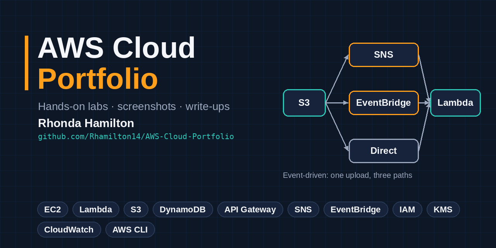

# Cloud Projects Portfolio

Hands-on AWS projects covering compute, serverless, storage, databases, security and event-driven architecture, plus a project-management simulation.

## Projects

| # | Project | What it shows | Services |
|---|---|---|---|
| 1 | [AWS CLI with CloudShell](01-aws-cli-cloudshell/) | Managing AWS from the command line | CLI, S3, Lambda, CloudWatch |
| 2 | [EC2 Hello World Web Server](02-ec2-hello-world-web-server/) | Launching and configuring a Linux web server | EC2, Security Groups, Apache |
| 3 | [Lambda Hello World](03-lambda-hello-world/) | Serverless basics, memory and concurrency | Lambda, IAM |
| 4 | [DynamoDB Basics](04-dynamodb-basics/) | NoSQL tables and key design | DynamoDB |
| 5 | [Lambda + DynamoDB CRUD](05-lambda-dynamodb-crud/) | Python serverless backend with boto3 | Lambda, DynamoDB, IAM |
| 6 | [S3 Security Hardening](06-s3-security-hardening/) | Least privilege, HTTPS-only, KMS encryption | S3, IAM, KMS, Lambda |
| 7 | [S3 Event-Driven Architecture](07-s3-event-driven-architecture/) | Fan-out and event routing | S3, Lambda, SNS, EventBridge |
| 8 | [API Gateway + Lambda + S3](08-api-gateway-lambda-s3/) | REST API with proxy and direct service integrations | API Gateway, Lambda, S3 |
| 9 | [ALB Path-Based Routing](09-alb-path-based-routing/) | Load balancer routing requests to Lambda by URL path | ELB (ALB), Lambda, VPC |
| 10 | [Well-Architected Review](10-well-architected-review/) | Assessing a workload against the six pillars and planning fixes | Well-Architected Tool, S3 |
| 11 | [SQS + Lambda Basics](11-sqs-lambda-basics/) | Decoupling a producer and consumer with a queue | SQS, Lambda, CloudWatch Logs |

## Skills
**AWS:** EC2 · Elastic Load Balancing · Lambda · S3 · DynamoDB · API Gateway · SQS · SNS · EventBridge · IAM · KMS · CloudWatch · CloudShell · Well-Architected Tool
**Languages and tools:** Python (boto3) · Bash · AWS CLI · JSON IAM policies · Linux

## About me
<!-- One or two lines about you, plus LinkedIn and email links -->
